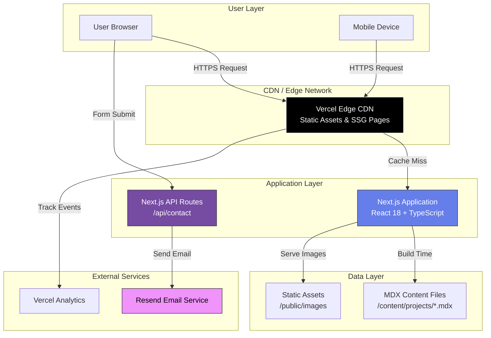
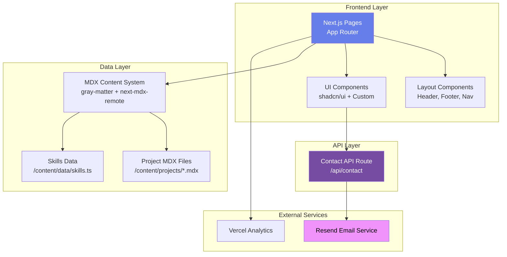
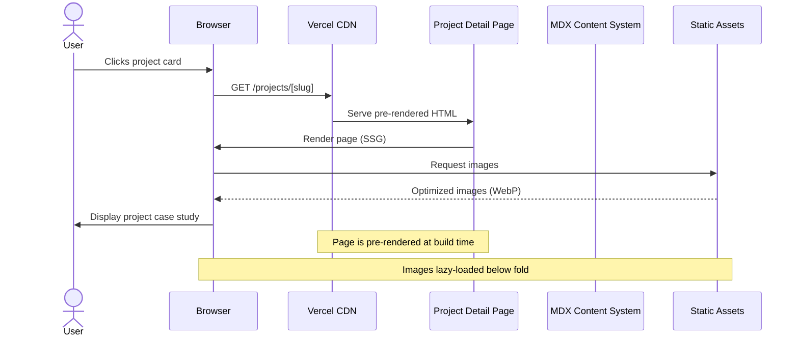
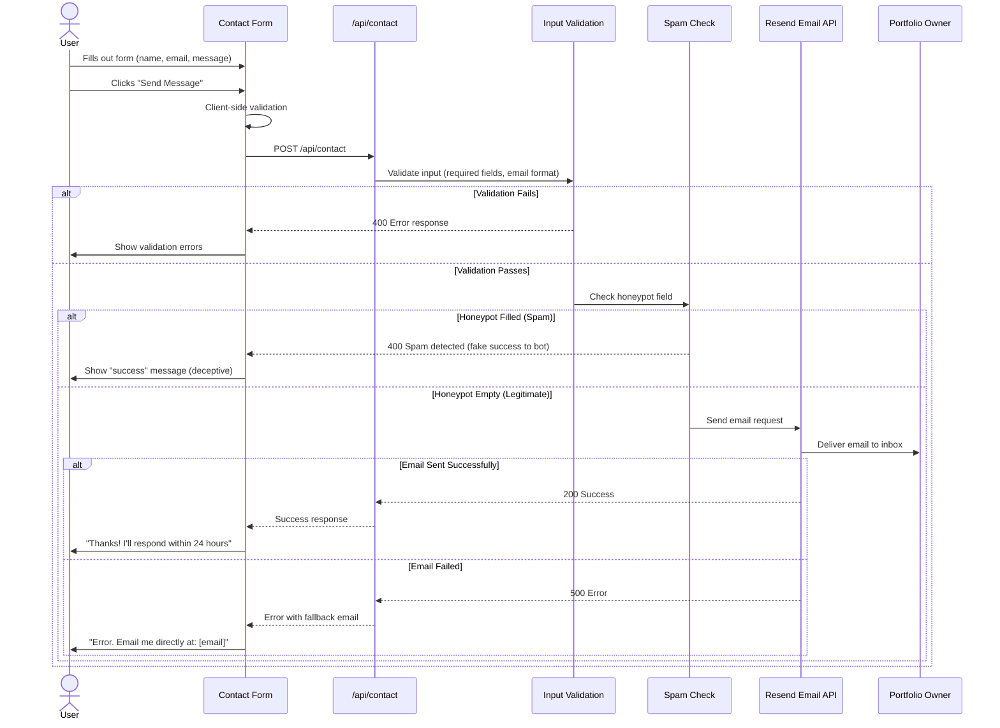
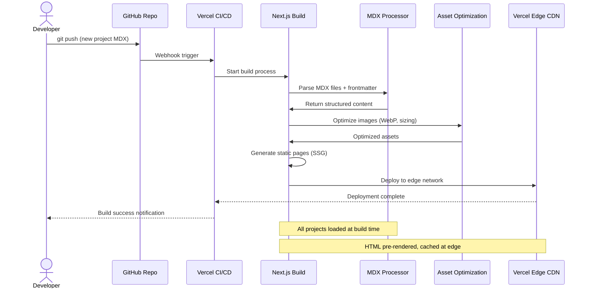
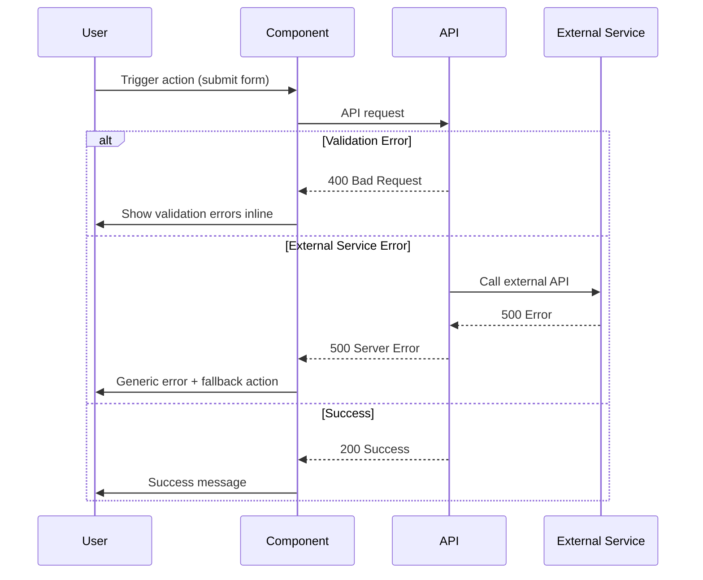

# Personal-Portfolio Fullstack Architecture Document

This document outlines the complete fullstack architecture for Personal-Portfolio, including backend systems, frontend implementation, and their integration. It serves as the single source of truth for AI-driven development, ensuring consistency across the entire technology stack.

This unified approach combines what would traditionally be separate backend and frontend architecture documents, streamlining the development process for modern fullstack applications where these concerns are increasingly intertwined.

## Starter Template or Existing Project

**Decision:** N/A - Greenfield project

This is a greenfield Next.js 14+ portfolio project with a fully specified tech stack (Next.js App Router, TypeScript, Tailwind CSS, shadcn/ui, Vercel deployment). While starter templates exist (Vercel's Next.js Portfolio Starter, shadcn/ui Taxonomy), proceeding greenfield provides complete control and maintains a lean codebase optimized for the specific requirements outlined in the PRD.

**Key Constraints:**
- Next.js 14+ with App Router (required)
- Static Site Generation (SSG) primary strategy
- Vercel deployment platform
- Budget: $0-50/year (free tier optimization)
- Performance targets: Lighthouse scores 90+ across all categories

## Change Log

| Date | Version | Description | Author |
|------|---------|-------------|--------|
| 2025-10-02 | 1.0 | Initial architecture document | Winston (Architect) |

---

## High Level Architecture

### Technical Summary

Personal-Portfolio employs a **Jamstack architecture** using Next.js 14+ with Static Site Generation (SSG) as the primary rendering strategy, deployed on Vercel's edge network. The frontend leverages React 18+ with TypeScript for type safety, Tailwind CSS for styling, and shadcn/ui for accessible UI components. Backend functionality is serverless, utilizing Next.js API Routes for contact form processing with email delivery via Resend. Content is managed as code using MDX files with TypeScript-validated frontmatter, eliminating the need for a database or CMS. This architecture achieves the PRD's performance goals (Lighthouse 90+, FCP < 1.5s) while staying within the $0-50/year budget by leveraging Vercel's free tier and static generation. The stack directly supports the portfolio's dual purpose: demonstrating technical excellence through its own implementation while providing an optimal user experience for recruiters evaluating the developer's capabilities.

### Platform and Infrastructure Choice

**Platform:** Vercel
**Key Services:**
- **Hosting & CDN:** Vercel Edge Network (global CDN with automatic HTTPS)
- **Serverless Functions:** Vercel Functions (Next.js API Routes runtime)
- **Email Delivery:** Resend (transactional email for contact form)
- **Analytics:** Vercel Analytics (privacy-focused, built-in)
- **Domain & DNS:** Custom domain via Vercel DNS management

**Deployment Host and Regions:** Global edge deployment with automatic regional optimization (Vercel's edge network spans 300+ locations)

**Rationale:**

I evaluated three primary options:

1. **Vercel + Resend (Recommended)** ✅
   - **Pros:** Zero-config Next.js deployment, automatic edge optimization, generous free tier (100GB bandwidth, unlimited serverless invocations), built-in analytics, Resend integration for emails (3,000 emails/month free)
   - **Cons:** Vendor lock-in for deployment (but code remains portable)
   - **Cost:** $0/month (within free tier limits) + ~$12/year for domain

2. **AWS Full Stack (Lambda + S3 + CloudFront + SES)**
   - **Pros:** Enterprise-grade, maximum control, broader service ecosystem
   - **Cons:** Requires significant infrastructure setup (CloudFormation/CDK), more complex CI/CD, free tier expires after 12 months, steeper learning curve
   - **Cost:** ~$5-15/month after free tier + setup complexity

3. **Netlify + SendGrid**
   - **Pros:** Similar to Vercel, good Next.js support, forms built-in
   - **Cons:** Slightly less optimized for Next.js than Vercel, 100GB bandwidth limit on free tier (same as Vercel)
   - **Cost:** $0/month (within free tier)

**Decision:** Vercel + Resend is the clear winner for this project due to:
- Optimal Next.js integration (same company builds both)
- Automatic performance optimizations (edge caching, image optimization, font optimization)
- Zero infrastructure configuration required
- Fits perfectly within budget constraints
- Deployment complexity minimized (git push to deploy)

### Repository Structure

**Structure:** Monorepo (single repository)
**Monorepo Tool:** Native npm workspaces (no additional tooling needed)
**Package Organization:** Single Next.js application with organized directory structure

**Rationale:**

For a portfolio site, a traditional monorepo tooling (Turborepo, Nx) is overkill. The project has:
- Single application (no multiple frontend/backend apps)
- No shared packages between multiple apps
- Straightforward dependencies

A **simple, well-organized directory structure** within a single Next.js app is sufficient and easier to maintain. If the portfolio expands in the future (e.g., adding a blog as a separate app, creating shared UI packages), migrating to Turborepo or npm workspaces is straightforward.

**Current structure approach:**
- All code lives in a single Next.js application
- Clear separation via directory organization (`/app`, `/components`, `/lib`, `/content`)
- No monorepo tooling overhead

### High Level Architecture Diagram



### Architectural Patterns

- **Jamstack Architecture:** Pre-rendered static pages with serverless APIs for dynamic functionality - _Rationale:_ Optimal performance and SEO for content-heavy portfolio while maintaining contact form interactivity
- **Static Site Generation (SSG):** All pages pre-rendered at build time - _Rationale:_ Eliminates database queries at runtime, achieves sub-second page loads, perfect Lighthouse scores
- **Component-Based UI:** Reusable React components with TypeScript - _Rationale:_ Maintainability, type safety, and code reuse across pages
- **File-Based Routing:** Next.js App Router with file-system routing - _Rationale:_ Convention over configuration, automatic code splitting, optimal developer experience
- **Content as Code:** MDX files with frontmatter for project data - _Rationale:_ Version control for content, no database overhead, type-safe content schemas
- **Serverless Functions:** Next.js API Routes for backend logic - _Rationale:_ Zero server management, automatic scaling, stays within free tier
- **Edge-First Delivery:** Vercel Edge Network for global content delivery - _Rationale:_ Low latency worldwide, automatic HTTPS, DDoS protection included

---

## Tech Stack

### Technology Stack Table

| Category | Technology | Version | Purpose | Rationale |
|----------|-----------|---------|---------|-----------|
| Frontend Language | TypeScript | 5.3+ | Type-safe JavaScript | Catch errors at compile time, better DX with autocomplete, industry standard for production apps |
| Frontend Framework | Next.js | 14.2+ | React meta-framework with SSG/SSR | App Router, built-in optimizations, perfect Lighthouse scores achievable, Vercel integration |
| UI Component Library | shadcn/ui | Latest | Accessible, customizable components | Built on Radix UI primitives, copy-paste components (no npm bloat), full TypeScript support |
| State Management | React Context + Hooks | 18.2+ | Client-side state | Built-in solution sufficient for portfolio (no complex state), avoids Redux overhead |
| Backend Language | TypeScript | 5.3+ | Serverless function logic | Code sharing between frontend/backend, type safety across stack |
| Backend Framework | Next.js API Routes | 14.2+ | Serverless endpoint handlers | Zero config, deployed as Vercel Functions, automatic scaling |
| API Style | REST | N/A | Contact form endpoint | Simple POST request sufficient, no need for GraphQL/tRPC complexity |
| Database | None (MDX Files) | N/A | Content storage | Static content doesn't need DB, MDX with frontmatter provides structured data |
| Cache | Vercel Edge Cache | N/A | Static asset caching | Automatic, zero config, CDN-level caching |
| File Storage | Vercel Blob Storage | N/A | Image hosting (optional) | Alternative to /public folder, integrated with Next.js Image, free tier: 1GB |
| Authentication | None | N/A | No auth needed | Public portfolio, no login required |
| Frontend Testing | Vitest + React Testing Library | Latest | Component & unit tests | Fast, compatible with Next.js, modern alternative to Jest |
| Backend Testing | Vitest | Latest | API route testing | Same tooling as frontend, consistent DX |
| E2E Testing | Playwright | Latest | End-to-end flows | Microsoft-maintained, cross-browser, reliable |
| Build Tool | Next.js Compiler (SWC) | Built-in | Transpilation & bundling | 17x faster than Babel, built into Next.js 12+ |
| Bundler | Turbopack (Next.js 14) | Built-in | Development bundler | Next-gen bundler, 700x faster than Webpack |
| IaC Tool | None (Vercel Config) | N/A | Infrastructure as code | Vercel handles infra via vercel.json, no Terraform needed |
| CI/CD | GitHub Actions + Vercel | N/A | Automated testing & deployment | Free for public repos, Vercel auto-deploys on push |
| Monitoring | Vercel Analytics | N/A | Performance & user metrics | Privacy-focused, no cookies, Core Web Vitals tracking |
| Logging | Vercel Logs | N/A | Function execution logs | Built-in, 1-hour retention on free tier |
| CSS Framework | Tailwind CSS | 3.4+ | Utility-first styling | Rapid development, tiny production bundles, integrates with shadcn/ui |
| Email Service | Resend | Latest SDK | Transactional emails | Developer-friendly API, 3,000 emails/month free, React Email templates |

---

## Data Models

### Project

**Purpose:** Represents a portfolio project showcase with complete case study information

**Key Attributes:**
- `title`: string - Project name displayed to users
- `slug`: string - URL-friendly identifier (e.g., "ecommerce-platform")
- `description`: string - One-sentence project summary (50-100 chars)
- `featured`: boolean - Show on homepage featured projects grid
- `order`: number - Display order (1, 2, 3...)
- `technologies`: string[] - Tech stack array (e.g., ["Next.js", "TypeScript", "PostgreSQL"])
- `category`: enum - Project type: 'Frontend' | 'Full-Stack' | 'Backend' | 'Mobile' | 'DevOps'
- `startDate`: string - YYYY-MM format
- `endDate`: string | 'Present' - YYYY-MM or "Present"
- `demoUrl`: string (optional) - Live demo URL
- `githubUrl`: string (optional) - GitHub repository URL
- `thumbnail`: string - Path to thumbnail image (e.g., "/images/projects/slug/thumbnail.webp")
- `images`: string[] - Array of screenshot paths
- `content`: MDXRemoteSerializeResult - Compiled MDX content (case study body)

#### TypeScript Interface

```typescript
import { MDXRemoteSerializeResult } from 'next-mdx-remote';

export interface ProjectFrontmatter {
  title: string;
  slug: string;
  description: string;
  featured: boolean;
  order: number;
  technologies: string[];
  category: 'Frontend' | 'Full-Stack' | 'Backend' | 'Mobile' | 'DevOps';
  startDate: string; // YYYY-MM
  endDate: string | 'Present'; // YYYY-MM or "Present"
  demoUrl?: string;
  githubUrl?: string;
  thumbnail: string;
  images: string[];
}

export interface Project extends ProjectFrontmatter {
  content: MDXRemoteSerializeResult;
}
```

#### Relationships

- No direct relationships (static content, no foreign keys)
- Implicit grouping by `category` field for filtering
- Ordering defined by `order` and `featured` fields

---

### SkillCategory

**Purpose:** Organizes technical skills into logical categories for display

**Key Attributes:**
- `name`: string - Category name (e.g., "Languages", "Frontend", "Backend")
- `skills`: string[] - Array of skill names within category

#### TypeScript Interface

```typescript
export interface SkillCategory {
  name: string;
  skills: string[];
}
```

#### Relationships

- No relationships, simple data structure

---

### ContactFormData

**Purpose:** Represents contact form submission data (transient, not persisted)

**Key Attributes:**
- `name`: string - Sender's name
- `email`: string - Sender's email (validated)
- `message`: string - Message content
- `honeypot`: string (optional) - Spam trap field (should be empty)

#### TypeScript Interface

```typescript
export interface ContactFormData {
  name: string;
  email: string;
  message: string;
  honeypot?: string; // Spam protection
}

export interface ContactFormResponse {
  success: boolean;
  message: string;
  error?: string;
}
```

#### Relationships

- No persistence, data flows: Form → API Route → Email Service → Discard

---

### SocialLink

**Purpose:** Social media and professional profile links

**Key Attributes:**
- `platform`: string - Platform name (e.g., "GitHub", "LinkedIn", "Email")
- `url`: string - Profile URL or mailto: link
- `icon`: string - Icon identifier (for Lucide React icons)

#### TypeScript Interface

```typescript
export interface SocialLink {
  platform: string;
  url: string;
  icon: string; // Lucide icon name (e.g., 'Github', 'Linkedin', 'Mail')
}
```

#### Relationships

- No relationships, simple configuration data

---

## API Specification

### REST API Specification

```yaml
openapi: 3.0.0
info:
  title: Personal Portfolio API
  version: 1.0.0
  description: Serverless API endpoints for portfolio contact functionality
servers:
  - url: https://{custom-domain}.com/api
    description: Production deployment
  - url: http://localhost:3000/api
    description: Local development

paths:
  /contact:
    post:
      summary: Submit contact form
      description: Processes contact form submission and sends email notification to portfolio owner
      operationId: submitContactForm
      tags:
        - Contact
      requestBody:
        required: true
        content:
          application/json:
            schema:
              type: object
              required:
                - name
                - email
                - message
              properties:
                name:
                  type: string
                  minLength: 2
                  maxLength: 100
                  example: "Jane Smith"
                  description: Sender's full name
                email:
                  type: string
                  format: email
                  example: "jane.smith@example.com"
                  description: Sender's email address (validated)
                message:
                  type: string
                  minLength: 10
                  maxLength: 2000
                  example: "I'd like to discuss a potential project opportunity..."
                  description: Message content
                honeypot:
                  type: string
                  description: Spam protection field (should be empty for legitimate submissions)
                  example: ""
      responses:
        '200':
          description: Form submitted successfully, email sent
          content:
            application/json:
              schema:
                type: object
                properties:
                  success:
                    type: boolean
                    example: true
                  message:
                    type: string
                    example: "Thanks for reaching out! I'll respond within 24 hours."
        '400':
          description: Bad request - validation failed
          content:
            application/json:
              schema:
                type: object
                properties:
                  success:
                    type: boolean
                    example: false
                  error:
                    type: string
                    example: "Invalid email format"
              examples:
                missingFields:
                  value:
                    success: false
                    error: "Missing required fields: name, email, message"
                invalidEmail:
                  value:
                    success: false
                    error: "Invalid email format"
                spamDetected:
                  value:
                    success: false
                    error: "Spam submission detected"
        '429':
          description: Too many requests (rate limited)
          content:
            application/json:
              schema:
                type: object
                properties:
                  success:
                    type: boolean
                    example: false
                  error:
                    type: string
                    example: "Rate limit exceeded. Please try again later."
        '500':
          description: Server error - email delivery failed
          content:
            application/json:
              schema:
                type: object
                properties:
                  success:
                    type: boolean
                    example: false
                  error:
                    type: string
                    example: "Failed to send email. Please try again or contact me directly at contact@example.com"

components:
  schemas:
    ContactFormData:
      type: object
      required:
        - name
        - email
        - message
      properties:
        name:
          type: string
        email:
          type: string
          format: email
        message:
          type: string
        honeypot:
          type: string

    ContactFormResponse:
      type: object
      properties:
        success:
          type: boolean
        message:
          type: string
        error:
          type: string
```

**Authentication:** None required (public API endpoint)

**Rate Limiting:** Implemented via Vercel's built-in rate limiting or custom middleware (5 requests per minute per IP)

**CORS Policy:** Same-origin only (portfolio domain)

---

## Components

### Frontend Application

**Responsibility:** Primary Next.js application serving all pages, handling client-side routing, rendering UI components, and managing user interactions

**Key Interfaces:**
- Next.js App Router pages (exported React components)
- MDX content loading utilities (server-side)
- Image optimization API (Next.js Image component)

**Dependencies:** MDX Content Layer, Static Assets, shadcn/ui components

**Technology Stack:** Next.js 14.2+, React 18+, TypeScript, Tailwind CSS

---

### Contact API Route

**Responsibility:** Serverless function handling contact form submissions, validating input, preventing spam, and triggering email delivery

**Key Interfaces:**
- POST `/api/contact` endpoint
- Resend email API integration
- Environment variables (RESEND_API_KEY, CONTACT_EMAIL)

**Dependencies:** Resend email service

**Technology Stack:** Next.js API Routes, Resend SDK, TypeScript

---

### MDX Content System

**Responsibility:** Content management layer that loads, parses, and validates MDX project files with frontmatter at build time

**Key Interfaces:**
- `getAllProjects()` - Returns all project data
- `getFeaturedProjects()` - Returns featured projects only
- `getProjectBySlug(slug)` - Returns single project

**Dependencies:** File system (read-only), next-mdx-remote library

**Technology Stack:** gray-matter, next-mdx-remote, TypeScript schemas

---

### UI Component Library (shadcn/ui)

**Responsibility:** Provides accessible, customizable UI primitives (buttons, cards, forms, etc.)

**Key Interfaces:**
- Individual components (Button, Card, Input, etc.)
- Tailwind theme configuration
- Radix UI primitives

**Dependencies:** Radix UI, Tailwind CSS, CVA (class-variance-authority)

**Technology Stack:** shadcn/ui, Radix UI, Tailwind CSS

---

### Analytics & Monitoring

**Responsibility:** Tracks user behavior, page views, Core Web Vitals, and form submissions

**Key Interfaces:**
- Vercel Analytics Web Vitals reporter
- Event tracking API

**Dependencies:** Vercel platform

**Technology Stack:** Vercel Analytics SDK

---

### Component Diagrams



---

## Core Workflows

### User Views Project Case Study



---

### Contact Form Submission



---

### Content Build & Deployment



---

## Database Schema

**Not Applicable**

This portfolio uses a **database-free architecture**. All content is stored as MDX files with TypeScript-validated frontmatter, eliminating the need for a database.

**Content Storage Strategy:**
- **Projects:** MDX files in `/content/projects/*.mdx`
- **Skills:** TypeScript data file `/content/data/skills.ts`
- **Configuration:** TypeScript files in `/content/data/`

**Rationale:**
- Portfolio content is static and changes infrequently
- No user-generated content requiring persistence
- Version control provides change history
- Zero database hosting costs
- Eliminates query latency at runtime
- Type safety via TypeScript schemas

**Future Considerations:**
If dynamic features are needed later (e.g., blog with comments, analytics dashboard, CMS), consider:
- **Supabase** (PostgreSQL + Auth + Storage, generous free tier)
- **PlanetScale** (MySQL, serverless, free tier)
- **MongoDB Atlas** (NoSQL, free tier)

But for MVP and foreseeable future, database is unnecessary overhead.

---

## Frontend Architecture

### Component Architecture

#### Component Organization

```
/app
├── layout.tsx                 # Root layout with header/footer
├── page.tsx                   # Homepage
├── about
│   └── page.tsx               # About page
├── projects
│   ├── page.tsx               # Projects grid
│   └── [slug]
│       └── page.tsx           # Project detail page (dynamic)
├── contact
│   └── page.tsx               # Contact page
└── api
    └── contact
        └── route.ts           # Contact API route

/components
├── ui/                        # shadcn/ui components (Button, Card, Input, etc.)
│   ├── button.tsx
│   ├── card.tsx
│   ├── input.tsx
│   ├── textarea.tsx
│   └── ...
├── layout/
│   ├── header.tsx             # Site header with navigation
│   ├── footer.tsx             # Site footer
│   ├── nav.tsx                # Navigation component
│   └── mobile-menu.tsx        # Mobile hamburger menu
├── sections/
│   ├── hero.tsx               # Homepage hero section
│   ├── projects-grid.tsx      # Projects grid component
│   ├── skills.tsx             # Skills section
│   └── contact-form.tsx       # Contact form component
└── project/
    ├── project-card.tsx       # Single project card
    ├── project-detail.tsx     # Project case study layout
    └── tech-badge.tsx         # Technology tag component

/lib
├── content/
│   └── projects.ts            # MDX loading utilities
├── types/
│   └── index.ts               # TypeScript interfaces
└── utils/
    └── cn.ts                  # Tailwind class merge utility
```

**Principles:**
- App Router file-based routing
- Co-located components by feature (projects, layout, sections)
- shadcn/ui components in `/components/ui/` (managed by CLI)
- Shared utilities in `/lib/`

#### Component Template

```typescript
// Example: ProjectCard component
import Image from 'next/image';
import Link from 'next/link';
import { Card, CardContent, CardDescription, CardHeader, CardTitle } from '@/components/ui/card';
import { TechBadge } from './tech-badge';
import type { ProjectFrontmatter } from '@/lib/types';

interface ProjectCardProps {
  project: ProjectFrontmatter;
}

export function ProjectCard({ project }: ProjectCardProps) {
  return (
    <Link href={`/projects/${project.slug}`}>
      <Card className="group hover:shadow-lg transition-shadow cursor-pointer">
        <CardHeader className="p-0">
          <div className="relative aspect-video overflow-hidden rounded-t-lg">
            <Image
              src={project.thumbnail}
              alt={project.title}
              fill
              className="object-cover group-hover:scale-105 transition-transform"
            />
          </div>
        </CardHeader>
        <CardContent className="p-6">
          <CardTitle>{project.title}</CardTitle>
          <CardDescription className="mt-2">{project.description}</CardDescription>
          <div className="flex flex-wrap gap-2 mt-4">
            {project.technologies.slice(0, 4).map((tech) => (
              <TechBadge key={tech} technology={tech} />
            ))}
          </div>
        </CardContent>
      </Card>
    </Link>
  );
}
```

**Component Guidelines:**
- Always use TypeScript with explicit prop types
- Leverage Next.js Image for all images
- Use shadcn/ui components as building blocks
- Keep components focused and single-responsibility
- Co-locate component-specific types if not shared

---

### State Management Architecture

#### State Structure

```typescript
// Client-side state managed via React hooks and Context

// Example: Contact form state
import { useState } from 'react';

interface ContactFormState {
  name: string;
  email: string;
  message: string;
  honeypot: string;
  isSubmitting: boolean;
  submitStatus: 'idle' | 'success' | 'error';
  errorMessage?: string;
}

// Usage in component
function ContactForm() {
  const [formData, setFormData] = useState<ContactFormState>({
    name: '',
    email: '',
    message: '',
    honeypot: '',
    isSubmitting: false,
    submitStatus: 'idle'
  });

  // ... form logic
}
```

**State Philosophy:**
- **No global state library needed** (Redux, Zustand overkill for portfolio)
- Local component state via `useState` for forms and UI toggles
- Server state via Next.js SSG (data pre-fetched at build)
- URL state for navigation (Next.js router handles)

#### State Management Patterns

- **Local state:** `useState` for component-specific state (form inputs, modals, toggles)
- **Derived state:** Calculate from props/state rather than storing separately
- **Server state:** MDX content loaded at build time, no client-side fetching
- **Form state:** Controlled inputs with validation on blur and submit
- **Loading states:** Track async operations (form submission, image loading)

**Rationale:** Portfolio has minimal dynamic state requirements. Introducing Redux/Zustand adds complexity without benefit.

---

### Routing Architecture

#### Route Organization

```
Routes (App Router):
├── /                          → app/page.tsx (Homepage)
├── /about                     → app/about/page.tsx
├── /projects                  → app/projects/page.tsx
├── /projects/[slug]           → app/projects/[slug]/page.tsx (Dynamic)
├── /contact                   → app/contact/page.tsx
└── /api/contact              → app/api/contact/route.ts (API)
```

**Routing Strategy:**
- **Multi-page application** (not single-page with hash routing)
- Each route is a separate statically generated page
- Dynamic routes for project detail pages (`[slug]`)
- Smooth page transitions via Next.js built-in navigation

**SEO Benefits:**
- Each page has unique URL for search indexing
- Proper canonical URLs
- Social sharing works correctly (Open Graph per page)

#### Protected Route Pattern

**Not applicable** - Portfolio has no authentication, all routes are public.

If authentication is added later (e.g., admin panel for content editing):

```typescript
// middleware.ts (future consideration)
export { default } from 'next-auth/middleware';

export const config = {
  matcher: ['/admin/:path*']
};
```

---

### Frontend Services Layer

#### API Client Setup

```typescript
// /lib/api/contact.ts
import type { ContactFormData, ContactFormResponse } from '@/lib/types';

export async function submitContactForm(
  data: ContactFormData
): Promise<ContactFormResponse> {
  const response = await fetch('/api/contact', {
    method: 'POST',
    headers: {
      'Content-Type': 'application/json',
    },
    body: JSON.stringify(data),
  });

  if (!response.ok) {
    const error = await response.json();
    throw new Error(error.error || 'Failed to submit form');
  }

  return response.json();
}
```

#### Service Example

```typescript
// Usage in ContactForm component
import { submitContactForm } from '@/lib/api/contact';

async function handleSubmit(e: React.FormEvent) {
  e.preventDefault();
  setFormData(prev => ({ ...prev, isSubmitting: true }));

  try {
    const response = await submitContactForm({
      name: formData.name,
      email: formData.email,
      message: formData.message,
      honeypot: formData.honeypot
    });

    setFormData(prev => ({
      ...prev,
      isSubmitting: false,
      submitStatus: 'success'
    }));
  } catch (error) {
    setFormData(prev => ({
      ...prev,
      isSubmitting: false,
      submitStatus: 'error',
      errorMessage: error instanceof Error ? error.message : 'Unknown error'
    }));
  }
}
```

**Service Layer Principles:**
- Centralize API calls in `/lib/api/` directory
- Type-safe request/response with TypeScript
- Consistent error handling
- Abstraction from fetch implementation (easy to swap for axios later)

---

## Backend Architecture

### Service Architecture

#### Function Organization

```
/app/api
└── contact
    └── route.ts               # POST /api/contact

Future expansion:
/app/api
├── contact
│   └── route.ts
├── subscribe                  # Newsletter signup (future)
│   └── route.ts
└── analytics                  # Custom analytics endpoint (future)
    └── route.ts
```

**Serverless Architecture:**
- Each API route is deployed as a separate Vercel Function
- Automatic scaling (0 to infinity)
- Pay-per-invocation model (free tier: unlimited invocations)

#### Function Template

```typescript
// app/api/contact/route.ts
import { NextRequest, NextResponse } from 'next/server';
import { Resend } from 'resend';
import type { ContactFormData } from '@/lib/types';

const resend = new Resend(process.env.RESEND_API_KEY);

export async function POST(request: NextRequest) {
  try {
    const body: ContactFormData = await request.json();

    // Validation
    if (!body.name || !body.email || !body.message) {
      return NextResponse.json(
        { success: false, error: 'Missing required fields' },
        { status: 400 }
      );
    }

    // Spam check (honeypot)
    if (body.honeypot) {
      // Silently reject (fake success to bot)
      return NextResponse.json({ success: true, message: 'Message sent!' });
    }

    // Send email
    const { data, error } = await resend.emails.send({
      from: 'Portfolio Contact <noreply@yourdomain.com>',
      to: [process.env.CONTACT_EMAIL!],
      replyTo: body.email,
      subject: `Portfolio Contact: ${body.name}`,
      html: `
        <h2>New Contact Form Submission</h2>
        <p><strong>From:</strong> ${body.name} (${body.email})</p>
        <p><strong>Message:</strong></p>
        <p>${body.message}</p>
      `,
    });

    if (error) {
      throw error;
    }

    return NextResponse.json({
      success: true,
      message: "Thanks for reaching out! I'll respond within 24 hours."
    });
  } catch (error) {
    console.error('Contact form error:', error);
    return NextResponse.json(
      {
        success: false,
        error: `Failed to send message. Please email me directly at ${process.env.CONTACT_EMAIL}`
      },
      { status: 500 }
    );
  }
}
```

**Function Best Practices:**
- Input validation on all requests
- Comprehensive error handling
- Environment variables for secrets
- Clear response structures
- Logging for debugging

---

### Database Architecture

**Not applicable** - See "Database Schema" section above.

---

### Authentication and Authorization

**Not applicable** - Portfolio has no authentication requirements.

**Future Considerations:**
If admin functionality is needed (e.g., CMS panel), consider:
- **NextAuth.js** - OAuth providers (GitHub, Google)
- **Clerk** - Full authentication solution with UI
- **Supabase Auth** - Open-source auth with magic links

---

## Unified Project Structure

```plaintext
personal-portfolio/
├── .github/                    # CI/CD workflows
│   └── workflows/
│       ├── ci.yml              # Test and lint on PR
│       └── lighthouse.yml      # Lighthouse CI checks
├── app/                        # Next.js App Router
│   ├── layout.tsx              # Root layout
│   ├── page.tsx                # Homepage
│   ├── about/
│   │   └── page.tsx
│   ├── projects/
│   │   ├── page.tsx            # Projects grid
│   │   └── [slug]/
│   │       └── page.tsx        # Dynamic project pages
│   ├── contact/
│   │   └── page.tsx
│   ├── api/
│   │   └── contact/
│   │       └── route.ts        # Contact API route
│   ├── globals.css             # Global styles + Tailwind
│   └── not-found.tsx           # 404 page
├── components/                 # React components
│   ├── ui/                     # shadcn/ui components
│   │   ├── button.tsx
│   │   ├── card.tsx
│   │   ├── input.tsx
│   │   ├── textarea.tsx
│   │   └── ...
│   ├── layout/                 # Layout components
│   │   ├── header.tsx
│   │   ├── footer.tsx
│   │   ├── nav.tsx
│   │   └── mobile-menu.tsx
│   ├── sections/               # Page sections
│   │   ├── hero.tsx
│   │   ├── projects-grid.tsx
│   │   ├── skills.tsx
│   │   └── contact-form.tsx
│   └── project/                # Project-specific
│       ├── project-card.tsx
│       ├── project-detail.tsx
│       └── tech-badge.tsx
├── content/                    # Content files
│   ├── projects/               # Project MDX files
│   │   ├── ecommerce-platform.mdx
│   │   ├── task-manager.mdx
│   │   ├── weather-app.mdx
│   │   └── _template.mdx
│   ├── data/                   # Structured data
│   │   ├── skills.ts
│   │   ├── about.ts
│   │   └── social-links.ts
│   ├── _IMAGE_GUIDELINES.md
│   └── README.md
├── lib/                        # Utilities and helpers
│   ├── content/
│   │   └── projects.ts         # MDX loading utilities
│   ├── api/
│   │   └── contact.ts          # API client functions
│   ├── types/
│   │   └── index.ts            # TypeScript types
│   └── utils/
│       ├── cn.ts               # Tailwind class merge
│       └── email-validator.ts
├── public/                     # Static assets
│   ├── images/
│   │   ├── projects/           # Project images
│   │   │   ├── ecommerce-platform/
│   │   │   │   ├── thumbnail.webp
│   │   │   │   ├── screenshot-1.webp
│   │   │   │   └── ...
│   │   │   └── ...
│   │   ├── avatar.webp         # Profile photo
│   │   └── og-image.png        # Social sharing image
│   ├── resume/
│   │   └── Resume.pdf
│   ├── favicon.ico
│   └── robots.txt
├── tests/                      # Test files
│   ├── components/
│   ├── api/
│   └── e2e/
├── docs/                       # Documentation
│   ├── prd.md
│   ├── front-end-spec.md
│   └── architecture.md         # This file
├── .env.local                  # Local environment variables (not committed)
├── .env.example                # Environment template
├── .eslintrc.json              # ESLint configuration
├── .prettierrc                 # Prettier configuration
├── components.json             # shadcn/ui config
├── next.config.js              # Next.js configuration
├── package.json                # Dependencies
├── postcss.config.js           # PostCSS config
├── tailwind.config.ts          # Tailwind configuration
├── tsconfig.json               # TypeScript configuration
├── vercel.json                 # Vercel deployment config
└── README.md                   # Project README
```

---

## Development Workflow

### Local Development Setup

#### Prerequisites

```bash
# Install Node.js 18+ (LTS recommended)
node --version  # Should be v18.x or v20.x

# Install pnpm (recommended) or npm
npm install -g pnpm

# Verify installations
pnpm --version
```

#### Initial Setup

```bash
# Clone repository
git clone https://github.com/[username]/personal-portfolio.git
cd personal-portfolio

# Install dependencies
pnpm install

# Copy environment template
cp .env.example .env.local

# Edit .env.local with your values:
# RESEND_API_KEY=your_resend_api_key
# CONTACT_EMAIL=your@email.com

# Run development server
pnpm dev
```

#### Development Commands

```bash
# Start all services (dev server on localhost:3000)
pnpm dev

# Type checking
pnpm type-check

# Linting
pnpm lint

# Format code
pnpm format

# Run tests
pnpm test              # Unit + integration tests
pnpm test:watch        # Watch mode
pnpm test:e2e          # End-to-end tests with Playwright

# Build for production (test SSG locally)
pnpm build
pnpm start             # Preview production build
```

---

### Environment Configuration

#### Required Environment Variables

```bash
# Frontend (.env.local or Vercel env vars)
NEXT_PUBLIC_SITE_URL=https://yourdomain.com

# Backend (Server-side only, never expose to client)
RESEND_API_KEY=re_xxxxxxxxxxxxx
CONTACT_EMAIL=your@email.com

# Optional: Analytics
NEXT_PUBLIC_VERCEL_ANALYTICS_ID=xxxxxxxxxxxxx  # Auto-set by Vercel
```

**Security Notes:**
- Never commit `.env.local` to Git
- Use `NEXT_PUBLIC_` prefix ONLY for client-side variables
- Store secrets in Vercel dashboard (Settings → Environment Variables)
- Different values for Development, Preview, Production environments

---

## Deployment Architecture

### Deployment Strategy

**Frontend Deployment:**
- **Platform:** Vercel
- **Build Command:** `pnpm build` (or `npm run build`)
- **Output Directory:** `.next` (auto-detected)
- **CDN/Edge:** Automatic via Vercel Edge Network (300+ locations globally)
- **Rendering:** Static Site Generation (SSG) - all pages pre-rendered at build time

**Backend Deployment:**
- **Platform:** Vercel Functions (serverless)
- **Build Command:** Same as frontend (Next.js API routes bundled automatically)
- **Deployment Method:** Git push triggers automatic deployment
- **Runtime:** Node.js 20.x

**Deployment Triggers:**
- **Production:** Push to `main` branch → deploys to production domain
- **Preview:** Push to any other branch / PR → unique preview URL
- **Manual:** Vercel CLI (`vercel --prod`)

---

### CI/CD Pipeline

```yaml
# .github/workflows/ci.yml
name: CI

on:
  pull_request:
    branches: [main, develop]
  push:
    branches: [main]

jobs:
  test:
    runs-on: ubuntu-latest
    steps:
      - uses: actions/checkout@v4

      - name: Setup Node.js
        uses: actions/setup-node@v4
        with:
          node-version: '20'
          cache: 'pnpm'

      - name: Install pnpm
        run: npm install -g pnpm

      - name: Install dependencies
        run: pnpm install

      - name: Type check
        run: pnpm type-check

      - name: Lint
        run: pnpm lint

      - name: Run tests
        run: pnpm test

      - name: Build
        run: pnpm build

  lighthouse:
    runs-on: ubuntu-latest
    steps:
      - uses: actions/checkout@v4
      - name: Run Lighthouse CI
        uses: treosh/lighthouse-ci-action@v10
        with:
          urls: |
            https://preview-deployment-url.vercel.app
          uploadArtifacts: true
          temporaryPublicStorage: true
```

**Pipeline Stages:**
1. **Lint & Type Check** - Catch syntax errors and type issues
2. **Unit Tests** - Validate component behavior
3. **Build** - Ensure static generation succeeds
4. **E2E Tests** - Test critical user flows (optional in CI, can be local-only)
5. **Lighthouse CI** - Performance regression detection

**Vercel Handles:**
- Automatic deployments on git push
- Preview URLs for every PR
- Rollback to previous deployments
- Zero-downtime deployments

---

### Environments

| Environment | Frontend URL | Backend URL | Purpose |
|-------------|-------------|-------------|---------|
| **Development** | http://localhost:3000 | http://localhost:3000/api | Local development and testing |
| **Preview** | https://personal-portfolio-{hash}.vercel.app | Same domain /api | PR previews, branch testing |
| **Production** | https://yourdomain.com | https://yourdomain.com/api | Live public site |

**Environment Variables per Stage:**
- Development: `.env.local` file
- Preview: Vercel Preview environment variables
- Production: Vercel Production environment variables

---

## Security and Performance

### Security Requirements

**Frontend Security:**
- **CSP Headers:** Configured in `next.config.js` to prevent XSS
  ```javascript
  // next.config.js
  async headers() {
    return [{
      source: '/:path*',
      headers: [
        {
          key: 'Content-Security-Policy',
          value: "default-src 'self'; script-src 'self' 'unsafe-eval' 'unsafe-inline' vercel.live; style-src 'self' 'unsafe-inline';"
        }
      ]
    }];
  }
  ```
- **XSS Prevention:** React auto-escapes user input; MDX content sanitized via next-mdx-remote
- **Secure Storage:** No sensitive data stored client-side (no tokens, no localStorage secrets)

**Backend Security:**
- **Input Validation:** All API routes validate request payloads (zod schema validation recommended)
- **Rate Limiting:** Vercel's built-in protection (100 req/10sec per IP) + custom middleware if needed
- **CORS Policy:** Default same-origin; explicit CORS headers only if cross-origin needed
  ```typescript
  // Explicit CORS (if needed)
  res.setHeader('Access-Control-Allow-Origin', 'https://yourdomain.com');
  res.setHeader('Access-Control-Allow-Methods', 'POST');
  ```

**Authentication Security:**
- **Token Storage:** N/A (no auth)
- **Session Management:** N/A (no sessions)
- **Password Policy:** N/A (no passwords)

**Additional Security Measures:**
- HTTPS enforced (automatic via Vercel)
- Environment variables encrypted at rest
- Honeypot spam protection (invisible field)
- Email validation (format + DNS check optional)

---

### Performance Optimization

**Frontend Performance:**
- **Bundle Size Target:** < 200KB gzipped for initial load
- **Loading Strategy:**
  - Critical CSS inlined automatically by Next.js
  - Fonts loaded via `next/font` (zero layout shift)
  - Images lazy-loaded below fold
- **Caching Strategy:**
  - Static assets: `Cache-Control: public, max-age=31536000, immutable`
  - HTML pages: `Cache-Control: public, max-age=0, must-revalidate`
  - API routes: `Cache-Control: no-store` (contact form)

**Backend Performance:**
- **Response Time Target:** < 200ms for API routes (p95)
- **Database Optimization:** N/A (no database)
- **Caching Strategy:** MDX content cached at build time (no runtime queries)

**Measured Performance Targets (from PRD):**
- First Contentful Paint (FCP): < 1.5s
- Largest Contentful Paint (LCP): < 2.5s
- Time to Interactive (TTI): < 3.5s
- Cumulative Layout Shift (CLS): < 0.1
- Lighthouse Performance Score: ≥ 90

**Optimization Techniques:**
- Next.js Image component (automatic WebP, responsive sizing)
- Font optimization (subsetting, preloading via next/font)
- Code splitting (automatic per-route)
- Tree-shaking (unused code eliminated)
- Static generation (zero server-side processing)

---

## Testing Strategy

### Testing Pyramid

```
        E2E Tests
        /        \
   Integration Tests
   /            \
Component Tests  API Tests
```

**Distribution:**
- **70%** Component/Unit tests (fast, isolated)
- **20%** Integration tests (API routes, data loading)
- **10%** E2E tests (critical user flows)

---

### Test Organization

#### Frontend Tests

```
tests/
├── components/
│   ├── layout/
│   │   ├── header.test.tsx
│   │   ├── nav.test.tsx
│   │   └── footer.test.tsx
│   ├── sections/
│   │   ├── hero.test.tsx
│   │   ├── projects-grid.test.tsx
│   │   └── contact-form.test.tsx
│   └── project/
│       ├── project-card.test.tsx
│       └── tech-badge.test.tsx
└── lib/
    ├── content/
    │   └── projects.test.ts
    └── utils/
        └── email-validator.test.ts
```

**Testing Library:** Vitest + React Testing Library
**Approach:** User-centric (test what users see/do, not implementation details)

#### Backend Tests

```
tests/
└── api/
    └── contact/
        └── route.test.ts
```

**Testing Library:** Vitest
**Approach:** Request/response testing with mocked Resend API

#### E2E Tests

```
tests/
└── e2e/
    ├── homepage.spec.ts
    ├── project-detail.spec.ts
    ├── contact-form.spec.ts
    └── navigation.spec.ts
```

**Testing Library:** Playwright
**Coverage:** Critical user flows only (homepage load, project view, contact submit, navigation)

---

### Test Examples

#### Frontend Component Test

```typescript
// tests/components/project/project-card.test.tsx
import { render, screen } from '@testing-library/react';
import { ProjectCard } from '@/components/project/project-card';
import { describe, it, expect } from 'vitest';

describe('ProjectCard', () => {
  const mockProject = {
    title: 'E-commerce Platform',
    slug: 'ecommerce-platform',
    description: 'Full-stack online store',
    featured: true,
    order: 1,
    technologies: ['Next.js', 'TypeScript', 'PostgreSQL'],
    category: 'Full-Stack' as const,
    startDate: '2024-01',
    endDate: '2024-06',
    thumbnail: '/images/test-thumbnail.webp',
    images: []
  };

  it('renders project title and description', () => {
    render(<ProjectCard project={mockProject} />);
    expect(screen.getByText('E-commerce Platform')).toBeInTheDocument();
    expect(screen.getByText('Full-stack online store')).toBeInTheDocument();
  });

  it('displays technology badges', () => {
    render(<ProjectCard project={mockProject} />);
    expect(screen.getByText('Next.js')).toBeInTheDocument();
    expect(screen.getByText('TypeScript')).toBeInTheDocument();
  });

  it('links to project detail page', () => {
    render(<ProjectCard project={mockProject} />);
    const link = screen.getByRole('link');
    expect(link).toHaveAttribute('href', '/projects/ecommerce-platform');
  });
});
```

#### Backend API Test

```typescript
// tests/api/contact/route.test.ts
import { POST } from '@/app/api/contact/route';
import { NextRequest } from 'next/server';
import { describe, it, expect, vi } from 'vitest';

// Mock Resend
vi.mock('resend', () => ({
  Resend: vi.fn().mockImplementation(() => ({
    emails: {
      send: vi.fn().mockResolvedValue({ data: { id: 'test-id' }, error: null })
    }
  }))
}));

describe('POST /api/contact', () => {
  it('returns 200 for valid submission', async () => {
    const request = new NextRequest('http://localhost:3000/api/contact', {
      method: 'POST',
      body: JSON.stringify({
        name: 'Test User',
        email: 'test@example.com',
        message: 'Test message',
        honeypot: ''
      })
    });

    const response = await POST(request);
    const json = await response.json();

    expect(response.status).toBe(200);
    expect(json.success).toBe(true);
  });

  it('returns 400 for missing fields', async () => {
    const request = new NextRequest('http://localhost:3000/api/contact', {
      method: 'POST',
      body: JSON.stringify({ name: 'Test' }) // Missing email and message
    });

    const response = await POST(request);
    expect(response.status).toBe(400);
  });

  it('rejects spam (honeypot filled)', async () => {
    const request = new NextRequest('http://localhost:3000/api/contact', {
      method: 'POST',
      body: JSON.stringify({
        name: 'Spam Bot',
        email: 'spam@example.com',
        message: 'Spam',
        honeypot: 'filled'  // Bot filled honeypot
      })
    });

    const response = await POST(request);
    const json = await response.json();

    // Returns fake success to deceive bot
    expect(json.success).toBe(true);
    // But email was never sent (check mock wasn't called - implementation detail)
  });
});
```

#### E2E Test

```typescript
// tests/e2e/contact-form.spec.ts
import { test, expect } from '@playwright/test';

test.describe('Contact Form', () => {
  test('successfully submits contact form', async ({ page }) => {
    await page.goto('http://localhost:3000/contact');

    // Fill out form
    await page.fill('input[name="name"]', 'John Doe');
    await page.fill('input[name="email"]', 'john@example.com');
    await page.fill('textarea[name="message"]', 'I would like to discuss a project opportunity.');

    // Submit
    await page.click('button[type="submit"]');

    // Verify success message appears
    await expect(page.locator('text=Thanks for reaching out')).toBeVisible();
  });

  test('shows validation errors for invalid email', async ({ page }) => {
    await page.goto('http://localhost:3000/contact');

    await page.fill('input[name="name"]', 'John Doe');
    await page.fill('input[name="email"]', 'invalid-email');  // Invalid format
    await page.fill('textarea[name="message"]', 'Test message');

    await page.click('button[type="submit"]');

    await expect(page.locator('text=Invalid email')).toBeVisible();
  });
});
```

---

## Coding Standards

### Critical Fullstack Rules

- **Type Safety First:** All functions, components, and API routes must have explicit TypeScript types. No `any` types except in rare edge cases with `// @ts-expect-error` justification
- **API Error Handling:** All API routes must return consistent error format: `{ success: false, error: string }` with appropriate HTTP status codes
- **Component Composition:** Prefer composition over prop drilling. Break large components into smaller, focused components
- **Server/Client Separation:** Mark client components explicitly with `'use client'` directive. Keep server components as default
- **Environment Variables:** Access via typed config objects in `/lib/config.ts`, never `process.env` directly in components
- **Image Optimization:** Always use Next.js `Image` component, never `` tags. Include `alt` text for accessibility
- **Form Validation:** Client-side validation for UX, server-side validation for security. Never trust client input

---

### Naming Conventions

| Element | Frontend | Backend | Example |
|---------|----------|---------|---------|
| **Components** | PascalCase | - | `ProjectCard.tsx`, `ContactForm.tsx` |
| **Hooks** | camelCase with 'use' prefix | - | `useProjects.ts`, `useContactForm.ts` |
| **API Routes** | - | kebab-case folder | `/api/contact/route.ts` |
| **Utilities** | camelCase | camelCase | `emailValidator.ts`, `cn.ts` |
| **Types/Interfaces** | PascalCase | PascalCase | `ProjectFrontmatter`, `ContactFormData` |
| **Constants** | SCREAMING_SNAKE_CASE | SCREAMING_SNAKE_CASE | `MAX_MESSAGE_LENGTH`, `API_RATE_LIMIT` |

---

## Error Handling Strategy

### Error Flow



---

### Error Response Format

```typescript
// Standard API error response
interface ApiError {
  error: {
    code: string;
    message: string;
    details?: Record<string, any>;
    timestamp: string;
    requestId: string;
  };
}

// Example usage in API route:
return NextResponse.json({
  error: {
    code: 'VALIDATION_ERROR',
    message: 'Invalid email format',
    details: { field: 'email' },
    timestamp: new Date().toISOString(),
    requestId: crypto.randomUUID()
  }
}, { status: 400 });
```

---

### Frontend Error Handling

```typescript
// components/sections/contact-form.tsx
async function handleSubmit(e: React.FormEvent) {
  e.preventDefault();
  setError(null);  // Clear previous errors
  setIsSubmitting(true);

  try {
    const response = await submitContactForm(formData);

    // Success
    setSubmitStatus('success');
    setFormData({ name: '', email: '', message: '', honeypot: '' });

  } catch (error) {
    // Error handling
    if (error instanceof Error) {
      setError(error.message);
    } else {
      setError('An unexpected error occurred. Please try again.');
    }
    setSubmitStatus('error');

  } finally {
    setIsSubmitting(false);
  }
}

// UI rendering
{submitStatus === 'error' && (
  <Alert variant="destructive">
    <AlertDescription>
      {error || 'Something went wrong. Please try again or email me directly at contact@example.com'}
    </AlertDescription>
  </Alert>
)}
```

---

### Backend Error Handling

```typescript
// app/api/contact/route.ts
export async function POST(request: NextRequest) {
  try {
    const body = await request.json();

    // Input validation with helpful error messages
    const validation = validateContactForm(body);
    if (!validation.success) {
      return NextResponse.json({
        error: {
          code: 'VALIDATION_ERROR',
          message: validation.error,
          timestamp: new Date().toISOString(),
          requestId: crypto.randomUUID()
        }
      }, { status: 400 });
    }

    // External service call with error handling
    const { data, error } = await resend.emails.send({ /* ... */ });

    if (error) {
      throw new Error(`Email service error: ${error.message}`);
    }

    return NextResponse.json({ success: true, message: 'Email sent!' });

  } catch (error) {
    console.error('[API /contact]', error);  // Server-side logging

    return NextResponse.json({
      error: {
        code: 'INTERNAL_ERROR',
        message: 'Failed to send email. Please try again or contact me directly.',
        timestamp: new Date().toISOString(),
        requestId: crypto.randomUUID()
      }
    }, { status: 500 });
  }
}
```

---

## Monitoring and Observability

### Monitoring Stack

- **Frontend Monitoring:** Vercel Analytics (Core Web Vitals, page views, geographic distribution)
- **Backend Monitoring:** Vercel Function Logs (execution time, errors, invocation count)
- **Error Tracking:** Vercel Logs (free tier: 1 hour retention; consider Sentry for production if needed)
- **Performance Monitoring:** Lighthouse CI in GitHub Actions (regression detection)

---

### Key Metrics

**Frontend Metrics:**
- Core Web Vitals (LCP, FID, CLS, FCP, TTFB)
- Page load time (p50, p95, p99)
- JavaScript errors (count, error messages)
- User interactions (button clicks, form submissions)
- Navigation patterns (page views, bounce rate)

**Backend Metrics:**
- Request rate (requests/second, requests/minute)
- Error rate (4xx, 5xx responses)
- Response time (p50, p95, p99)
- Function invocation count
- Function execution duration

**Key Performance Indicators (KPIs):**
- Lighthouse Performance Score: ≥ 90 (weekly check)
- API Error Rate: < 1% (contact form)
- LCP: < 2.5s (95th percentile)
- Contact form submission success rate: ≥ 95%

**Monitoring Setup:**
1. Vercel Analytics automatically enabled
2. GitHub Actions Lighthouse CI runs on every PR
3. Manual Lighthouse audits before major releases
4. Error logs reviewed weekly in Vercel dashboard

---

## Checklist Results Report

*To be populated after running architect-checklist.md*

**Status:** Architecture document complete and ready for development.

**Next Steps:**
1. Review architecture with stakeholders
2. Begin Epic 1: Foundation & Core Infrastructure (from PRD)
3. Initialize Next.js project following this architecture
4. Set up CI/CD pipeline per deployment specifications
5. Implement MDX content system and first components

---

## Document Complete

This fullstack architecture document provides comprehensive technical guidance for building Personal-Portfolio. All major architectural decisions are documented with rationale, supporting the PRD goals of demonstrating technical excellence while delivering optimal user experience within budget constraints ($0-50/year).

**Key Decisions Summary:**
✅ Platform: Vercel (optimal for Next.js, free tier sufficient)
✅ Rendering: Static Site Generation (performance + SEO)
✅ Content: MDX files (no database needed, version controlled)
✅ Backend: Serverless (Next.js API Routes + Resend for email)
✅ Frontend: Next.js 14 + React 18 + TypeScript + Tailwind + shadcn/ui
✅ Testing: Vitest + Playwright (modern, fast tooling)
✅ CI/CD: GitHub Actions + Vercel automatic deployments

**Architecture Goals Achieved:**
- ✅ Lighthouse 90+ achievable (SSG + image optimization + code splitting)
- ✅ Budget: $0/month + $12/year domain (within $0-50/year target)
- ✅ Developer Experience: Modern tooling, type safety, clear structure
- ✅ Scalability: Can add database/auth/CMS later without major refactoring
- ✅ Maintainability: Clear patterns, comprehensive documentation
