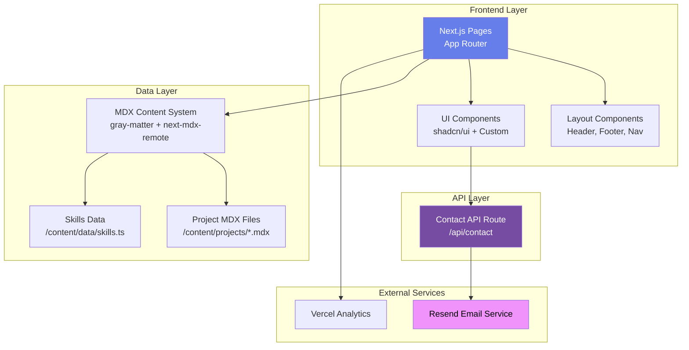

# Components

## Frontend Application

**Responsibility:** Primary Next.js application serving all pages, handling client-side routing, rendering UI components, and managing user interactions

**Key Interfaces:**
- Next.js App Router pages (exported React components)
- MDX content loading utilities (server-side)
- Image optimization API (Next.js Image component)

**Dependencies:** MDX Content Layer, Static Assets, shadcn/ui components

**Technology Stack:** Next.js 14.2+, React 18+, TypeScript, Tailwind CSS

---

## Contact API Route

**Responsibility:** Serverless function handling contact form submissions, validating input, preventing spam, and triggering email delivery

**Key Interfaces:**
- POST `/api/contact` endpoint
- Resend email API integration
- Environment variables (RESEND_API_KEY, CONTACT_EMAIL)

**Dependencies:** Resend email service

**Technology Stack:** Next.js API Routes, Resend SDK, TypeScript

---

## MDX Content System

**Responsibility:** Content management layer that loads, parses, and validates MDX project files with frontmatter at build time

**Key Interfaces:**
- `getAllProjects()` - Returns all project data
- `getFeaturedProjects()` - Returns featured projects only
- `getProjectBySlug(slug)` - Returns single project

**Dependencies:** File system (read-only), next-mdx-remote library

**Technology Stack:** gray-matter, next-mdx-remote, TypeScript schemas

---

## UI Component Library (shadcn/ui)

**Responsibility:** Provides accessible, customizable UI primitives (buttons, cards, forms, etc.)

**Key Interfaces:**
- Individual components (Button, Card, Input, etc.)
- Tailwind theme configuration
- Radix UI primitives

**Dependencies:** Radix UI, Tailwind CSS, CVA (class-variance-authority)

**Technology Stack:** shadcn/ui, Radix UI, Tailwind CSS

---

## Analytics & Monitoring

**Responsibility:** Tracks user behavior, page views, Core Web Vitals, and form submissions

**Key Interfaces:**
- Vercel Analytics Web Vitals reporter
- Event tracking API

**Dependencies:** Vercel platform

**Technology Stack:** Vercel Analytics SDK

---

## Component Diagrams

---
