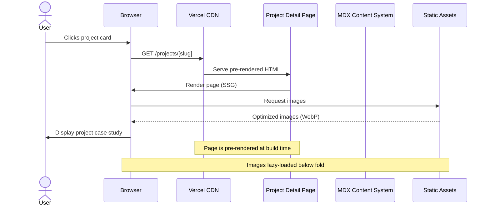
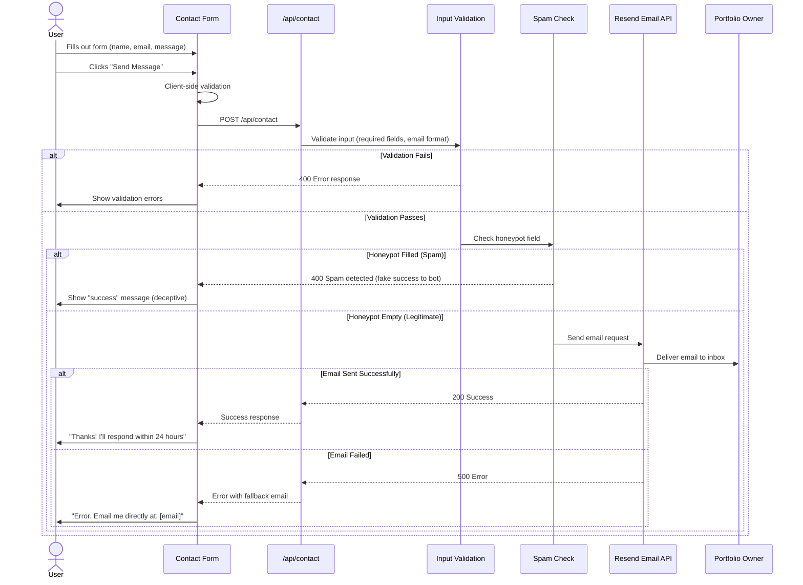
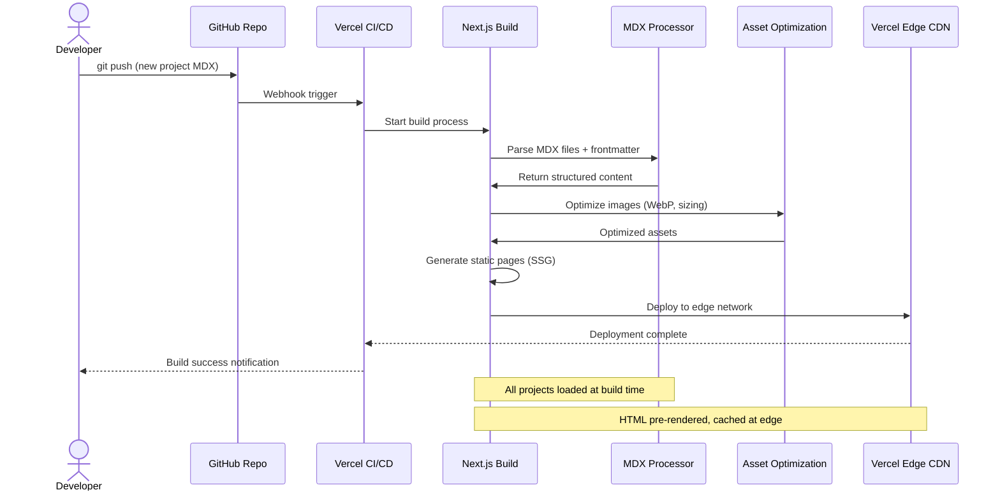

# Core Workflows

## User Views Project Case Study

```mermaid
sequenceDiagram
    actor User
    participant Browser
    participant Vercel as Vercel CDN
    participant Page as Project Detail Page
    participant MDX as MDX Content System
    participant Assets as Static Assets

    User->>Browser: Clicks project card
    Browser->>Vercel: GET /projects/[slug]
    Vercel->>Page: Serve pre-rendered HTML
    Page->>Browser: Render page (SSG)
    Browser->>Assets: Request images
    Assets-->>Browser: Optimized images (WebP)
    Browser->>User: Display project case study

    Note over Vercel,Page: Page is pre-rendered at build time
    Note over Browser,Assets: Images lazy-loaded below fold
```

---

## Contact Form Submission

```mermaid
sequenceDiagram
    actor User
    participant Form as Contact Form
    participant API as /api/contact
    participant Validation as Input Validation
    participant Honeypot as Spam Check
    participant Resend as Resend Email API
    participant Owner as Portfolio Owner

    User->>Form: Fills out form (name, email, message)
    User->>Form: Clicks "Send Message"
    Form->>Form: Client-side validation
    Form->>API: POST /api/contact
    API->>Validation: Validate input (required fields, email format)

    alt Validation Fails
        Validation-->>Form: 400 Error response
        Form->>User: Show validation errors
    else Validation Passes
        Validation->>Honeypot: Check honeypot field

        alt Honeypot Filled (Spam)
            Honeypot-->>Form: 400 Spam detected (fake success to bot)
            Form->>User: Show "success" message (deceptive)
        else Honeypot Empty (Legitimate)
            Honeypot->>Resend: Send email request
            Resend->>Owner: Deliver email to inbox

            alt Email Sent Successfully
                Resend-->>API: 200 Success
                API-->>Form: Success response
                Form->>User: "Thanks! I'll respond within 24 hours"
            else Email Failed
                Resend-->>API: 500 Error
                API-->>Form: Error with fallback email
                Form->>User: "Error. Email me directly at: [email]"
            end
        end
    end
```

---

## Content Build & Deployment

```mermaid
sequenceDiagram
    actor Dev as Developer
    participant Git as GitHub Repo
    participant Vercel as Vercel CI/CD
    participant Build as Next.js Build
    participant MDX as MDX Processor
    participant Assets as Asset Optimization
    participant CDN as Vercel Edge CDN

    Dev->>Git: git push (new project MDX)
    Git->>Vercel: Webhook trigger
    Vercel->>Build: Start build process
    Build->>MDX: Parse MDX files + frontmatter
    MDX->>Build: Return structured content
    Build->>Assets: Optimize images (WebP, sizing)
    Assets->>Build: Optimized assets
    Build->>Build: Generate static pages (SSG)
    Build->>CDN: Deploy to edge network
    CDN-->>Vercel: Deployment complete
    Vercel-->>Dev: Build success notification

    Note over MDX,Build: All projects loaded at build time
    Note over Build,CDN: HTML pre-rendered, cached at edge
```

---
