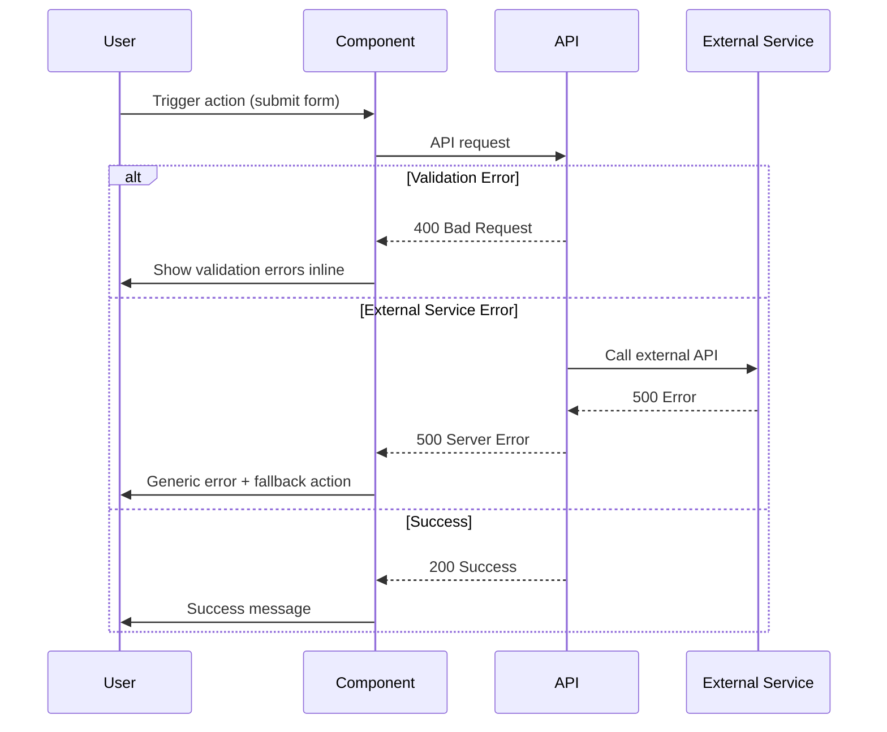

# Error Handling Strategy

## Error Flow



---

## Error Response Format

```typescript
// Standard API error response
interface ApiError {
  error: {
    code: string;
    message: string;
    details?: Record<string, any>;
    timestamp: string;
    requestId: string;
  };
}

// Example usage in API route:
return NextResponse.json({
  error: {
    code: 'VALIDATION_ERROR',
    message: 'Invalid email format',
    details: { field: 'email' },
    timestamp: new Date().toISOString(),
    requestId: crypto.randomUUID()
  }
}, { status: 400 });
```

---

## Frontend Error Handling

```typescript
// components/sections/contact-form.tsx
async function handleSubmit(e: React.FormEvent) {
  e.preventDefault();
  setError(null);  // Clear previous errors
  setIsSubmitting(true);

  try {
    const response = await submitContactForm(formData);

    // Success
    setSubmitStatus('success');
    setFormData({ name: '', email: '', message: '', honeypot: '' });

  } catch (error) {
    // Error handling
    if (error instanceof Error) {
      setError(error.message);
    } else {
      setError('An unexpected error occurred. Please try again.');
    }
    setSubmitStatus('error');

  } finally {
    setIsSubmitting(false);
  }
}

// UI rendering
{submitStatus === 'error' && (
  <Alert variant="destructive">
    <AlertDescription>
      {error || 'Something went wrong. Please try again or email me directly at contact@example.com'}
    </AlertDescription>
  </Alert>
)}
```

---

## Backend Error Handling

```typescript
// app/api/contact/route.ts
export async function POST(request: NextRequest) {
  try {
    const body = await request.json();

    // Input validation with helpful error messages
    const validation = validateContactForm(body);
    if (!validation.success) {
      return NextResponse.json({
        error: {
          code: 'VALIDATION_ERROR',
          message: validation.error,
          timestamp: new Date().toISOString(),
          requestId: crypto.randomUUID()
        }
      }, { status: 400 });
    }

    // External service call with error handling
    const { data, error } = await resend.emails.send({ /* ... */ });

    if (error) {
      throw new Error(`Email service error: ${error.message}`);
    }

    return NextResponse.json({ success: true, message: 'Email sent!' });

  } catch (error) {
    console.error('[API /contact]', error);  // Server-side logging

    return NextResponse.json({
      error: {
        code: 'INTERNAL_ERROR',
        message: 'Failed to send email. Please try again or contact me directly.',
        timestamp: new Date().toISOString(),
        requestId: crypto.randomUUID()
      }
    }, { status: 500 });
  }
}
```

---
