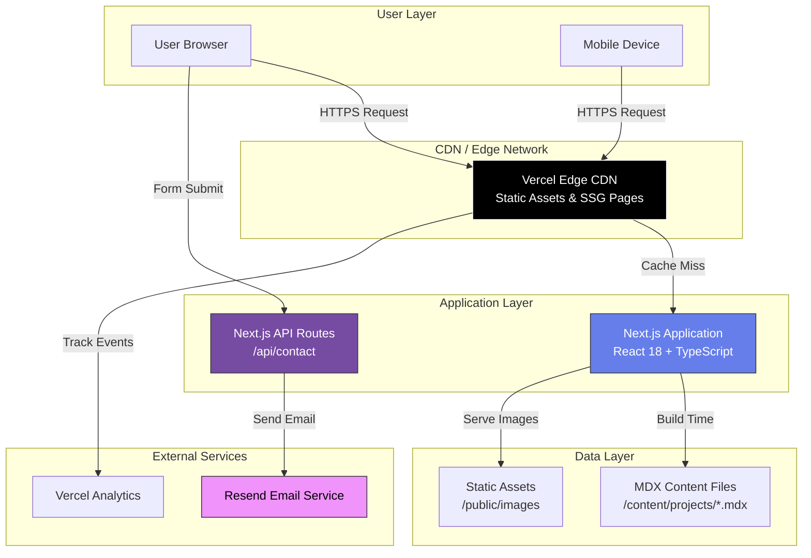

# High Level Architecture

## Technical Summary

Personal-Portfolio employs a **Jamstack architecture** using Next.js 14+ with Static Site Generation (SSG) as the primary rendering strategy, deployed on Vercel's edge network. The frontend leverages React 18+ with TypeScript for type safety, Tailwind CSS for styling, and shadcn/ui for accessible UI components. Backend functionality is serverless, utilizing Next.js API Routes for contact form processing with email delivery via Resend. Content is managed as code using MDX files with TypeScript-validated frontmatter, eliminating the need for a database or CMS. This architecture achieves the PRD's performance goals (Lighthouse 90+, FCP < 1.5s) while staying within the $0-50/year budget by leveraging Vercel's free tier and static generation. The stack directly supports the portfolio's dual purpose: demonstrating technical excellence through its own implementation while providing an optimal user experience for recruiters evaluating the developer's capabilities.

## Platform and Infrastructure Choice

**Platform:** Vercel
**Key Services:**
- **Hosting & CDN:** Vercel Edge Network (global CDN with automatic HTTPS)
- **Serverless Functions:** Vercel Functions (Next.js API Routes runtime)
- **Email Delivery:** Resend (transactional email for contact form)
- **Analytics:** Vercel Analytics (privacy-focused, built-in)
- **Domain & DNS:** Custom domain via Vercel DNS management

**Deployment Host and Regions:** Global edge deployment with automatic regional optimization (Vercel's edge network spans 300+ locations)

**Rationale:**

I evaluated three primary options:

1. **Vercel + Resend (Recommended)** ✅
   - **Pros:** Zero-config Next.js deployment, automatic edge optimization, generous free tier (100GB bandwidth, unlimited serverless invocations), built-in analytics, Resend integration for emails (3,000 emails/month free)
   - **Cons:** Vendor lock-in for deployment (but code remains portable)
   - **Cost:** $0/month (within free tier limits) + ~$12/year for domain

2. **AWS Full Stack (Lambda + S3 + CloudFront + SES)**
   - **Pros:** Enterprise-grade, maximum control, broader service ecosystem
   - **Cons:** Requires significant infrastructure setup (CloudFormation/CDK), more complex CI/CD, free tier expires after 12 months, steeper learning curve
   - **Cost:** ~$5-15/month after free tier + setup complexity

3. **Netlify + SendGrid**
   - **Pros:** Similar to Vercel, good Next.js support, forms built-in
   - **Cons:** Slightly less optimized for Next.js than Vercel, 100GB bandwidth limit on free tier (same as Vercel)
   - **Cost:** $0/month (within free tier)

**Decision:** Vercel + Resend is the clear winner for this project due to:
- Optimal Next.js integration (same company builds both)
- Automatic performance optimizations (edge caching, image optimization, font optimization)
- Zero infrastructure configuration required
- Fits perfectly within budget constraints
- Deployment complexity minimized (git push to deploy)

## Repository Structure

**Structure:** Monorepo (single repository)
**Monorepo Tool:** Native npm workspaces (no additional tooling needed)
**Package Organization:** Single Next.js application with organized directory structure

**Rationale:**

For a portfolio site, a traditional monorepo tooling (Turborepo, Nx) is overkill. The project has:
- Single application (no multiple frontend/backend apps)
- No shared packages between multiple apps
- Straightforward dependencies

A **simple, well-organized directory structure** within a single Next.js app is sufficient and easier to maintain. If the portfolio expands in the future (e.g., adding a blog as a separate app, creating shared UI packages), migrating to Turborepo or npm workspaces is straightforward.

**Current structure approach:**
- All code lives in a single Next.js application
- Clear separation via directory organization (`/app`, `/components`, `/lib`, `/content`)
- No monorepo tooling overhead

## High Level Architecture Diagram

## Architectural Patterns

- **Jamstack Architecture:** Pre-rendered static pages with serverless APIs for dynamic functionality - _Rationale:_ Optimal performance and SEO for content-heavy portfolio while maintaining contact form interactivity
- **Static Site Generation (SSG):** All pages pre-rendered at build time - _Rationale:_ Eliminates database queries at runtime, achieves sub-second page loads, perfect Lighthouse scores
- **Component-Based UI:** Reusable React components with TypeScript - _Rationale:_ Maintainability, type safety, and code reuse across pages
- **File-Based Routing:** Next.js App Router with file-system routing - _Rationale:_ Convention over configuration, automatic code splitting, optimal developer experience
- **Content as Code:** MDX files with frontmatter for project data - _Rationale:_ Version control for content, no database overhead, type-safe content schemas
- **Serverless Functions:** Next.js API Routes for backend logic - _Rationale:_ Zero server management, automatic scaling, stays within free tier
- **Edge-First Delivery:** Vercel Edge Network for global content delivery - _Rationale:_ Low latency worldwide, automatic HTTPS, DDoS protection included

---
