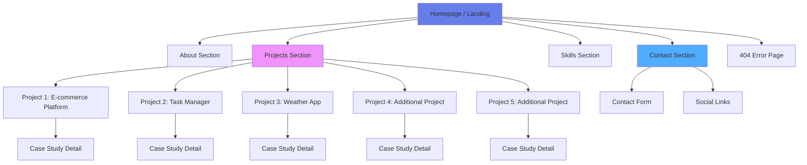
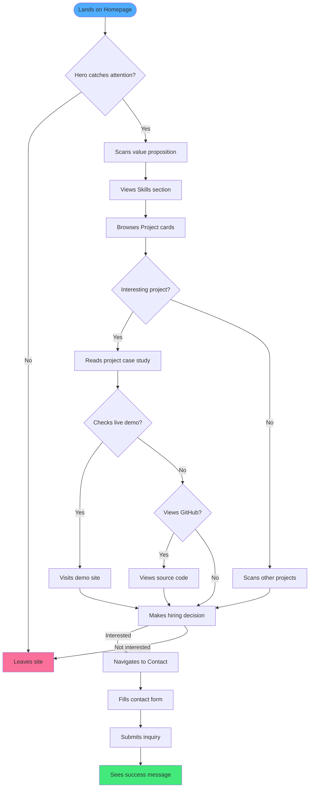
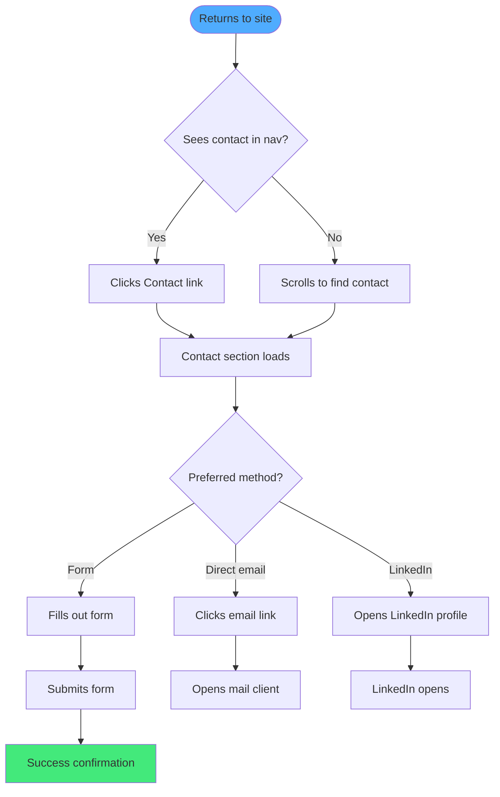
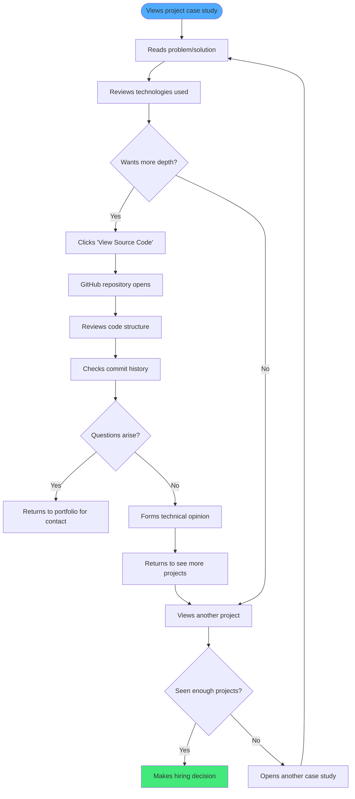

# Personal-Portfolio UI/UX Specification

This document defines the user experience goals, information architecture, user flows, and visual design specifications for Personal-Portfolio's user interface. It serves as the foundation for visual design and frontend development, ensuring a cohesive and user-centered experience.

## Introduction

### Overall UX Goals & Principles

#### Target User Personas

**Primary: Technical Recruiters & Hiring Managers**
- Time-constrained professionals scanning portfolios quickly
- Need to assess technical skills and project quality within 2-3 minutes
- Looking for: relevant tech stack, project complexity, code quality indicators
- Device context: Primarily desktop at work, but also mobile for casual browsing
- Pain points: Generic portfolios, missing live demos, unclear project impact

**Secondary: Potential Clients & Collaborators**
- Seeking developers for freelance or contract work
- Focus on problem-solving approach and communication style
- Need to understand what problems the developer can solve
- Device context: Mixed desktop and mobile
- Pain points: Overly technical jargon, missing business impact, no clear contact path

**Tertiary: Fellow Developers & Community**
- Interested in technical implementation details
- May want to connect professionally or collaborate
- Device context: Desktop and mobile
- Value: Code quality, interesting technical challenges, open source contributions

#### Usability Goals

1. **Speed to Value:** First-time visitors understand developer's core value proposition within 10 seconds of landing
2. **Effortless Navigation:** Critical information (skills, projects, contact) accessible within 2 clicks maximum
3. **Scan-friendly Content:** Project showcases and skills are scannable with clear visual hierarchy
4. **Zero Friction Contact:** Recruiters can initiate contact without leaving the site or complex forms
5. **Performance as Feature:** Sub-3-second page loads demonstrate technical competence through the portfolio itself
6. **Mobile Parity:** Core information and contact flows work seamlessly on mobile (not degraded experience)

#### Design Principles

1. **Clarity over Cleverness** - Prioritize clear communication over aesthetic innovation. Recruiters are busy; respect their time with direct, scannable content.

2. **Progressive Disclosure** - Show project summaries first, full case studies on demand. Don't overwhelm with information; let users drill down at their own pace.

3. **Consistent Patterns** - Use familiar UI patterns (cards for projects, tags for skills, standard form fields). Innovation should be in content quality, not basic UI paradigms.

4. **Immediate Feedback** - Every interaction (hover, click, form submission) provides instant visual response. No dead ends or confusion about whether an action registered.

5. **Performance is UX** - Fast load times, smooth scrolling, optimized images aren't just technical requirements—they're core to the user experience and portfolio credibility.

#### Change Log

| Date | Version | Description | Author |
|------|---------|-------------|--------|
| 2025-10-02 | 1.0 | Initial UI/UX specification | Sally (UX Expert) |

---

## Information Architecture

### Site Map / Screen Inventory



### Navigation Structure

**Primary Navigation:**
Fixed header navigation visible on all pages/sections with links to: Home, About, Projects, Skills, Contact. On mobile, this collapses into a hamburger menu. Navigation remains accessible and consistent throughout the experience, with smooth scroll behavior for single-page implementation or clean page transitions for multi-page approach.

**Secondary Navigation:**
- Project detail pages include "Back to Projects" link
- Project cards within the Projects section act as navigation to individual case studies
- Footer includes duplicate primary nav links plus social media links (GitHub, LinkedIn, Email)
- Resume download button available in About section (prominent CTA)

**Breadcrumb Strategy:**
Given the shallow architecture (2-3 levels maximum), traditional breadcrumbs are unnecessary. Instead, context is maintained through:
- Clear page/section titles
- "Back to Projects" links on project detail pages
- Persistent header navigation showing current location (active state highlighting)

---

## User Flows

### Flow 1: First-Time Visitor Evaluating Developer

**User Goal:** Recruiter wants to quickly assess if developer matches job requirements and is worth deeper investigation

**Entry Points:** Landing page hero section (from search, social media link, or direct URL)

**Success Criteria:** Within 2-3 minutes, recruiter has clear understanding of tech stack, project quality, and knows how to initiate contact

#### Flow Diagram



#### Edge Cases & Error Handling:
- **Slow connection:** Progressive image loading with placeholders prevents blank states
- **JavaScript disabled:** Core content still readable, forms still functional
- **Project demo offline:** Clear messaging + GitHub link as fallback
- **Form submission failure:** Error message with direct email as backup contact method
- **Mobile browsing:** Optimized touch targets, simplified navigation

**Notes:** This is the most critical flow—optimization should focus here. Every friction point (slow images, confusing navigation, broken links) directly impacts conversion.

---

### Flow 2: Returning Visitor Seeking Contact Information

**User Goal:** Someone who previously viewed the portfolio now wants to reach out (perhaps after internal discussion)

**Entry Points:** Direct URL, bookmark, or search result

**Success Criteria:** Can quickly find and use contact method without re-navigating entire portfolio

#### Flow Diagram



#### Edge Cases & Error Handling:
- **Contact section not immediately visible:** Persistent nav with Contact link always accessible
- **Form already submitted previously:** Form allows multiple submissions (no blocking)
- **Mail client not configured:** Multiple contact options available (form, LinkedIn, direct email display)

**Notes:** Contact should be frictionless. No elaborate forms, no gatekeeping. Make it easy to start a conversation.

---

### Flow 3: Technical Deep Dive - Developer Reviewing Code Quality

**User Goal:** Hiring manager or technical lead wants to assess actual code quality and technical decisions

**Entry Points:** Project case study page (likely from Projects grid)

**Success Criteria:** Can access source code, understand technical approach, and evaluate implementation quality

#### Flow Diagram



#### Edge Cases & Error Handling:
- **Private repository:** Clear explanation + screenshot/video demo as alternative
- **GitHub link broken:** Additional links (live demo, npm package) as fallbacks
- **Code in different location:** Clear documentation in case study about where code lives
- **Missing README in repo:** Case study serves as documentation substitute

**Notes:** Some best projects may be proprietary. Ensure case studies can stand alone when code isn't viewable.

---

## Wireframes & Mockups

**Primary Design Files:** Design work will be created using **Figma** (recommended for component-based design and easy developer handoff). Initial wireframes can be low-fidelity, progressing to high-fidelity mockups with actual content.

**Figma Link:** *[To be added once design file is created]*

### Key Screen Layouts

#### 1. Homepage / Landing Page

**Purpose:** Create immediate positive first impression, communicate value proposition, and provide clear navigation to key areas

**Key Elements:**
- **Hero Section (Above fold):**
  - Professional photo or avatar (approachable, friendly expression)
  - Name and primary role heading (e.g., "Full-Stack Developer")
  - Value proposition tagline (1-2 sentences, conversational tone)
  - Primary CTA button: "View My Work" or "See Projects"
  - Secondary CTA: "Let's Connect"
  - Subtle background pattern or gradient (not distracting)

- **Skills Overview (Second section):**
  - Section heading: "What I Work With"
  - Categorized skill tags (Languages, Frameworks, Tools)
  - Visual badges/icons for major technologies
  - Brief explanatory text about approach

- **Featured Projects Grid (Third section):**
  - Section heading: "Recent Projects"
  - 3-5 project cards in responsive grid
  - Each card: thumbnail, title, 1-sentence description, tech tags
  - Hover state shows "View Details" overlay

- **About Preview (Fourth section):**
  - Brief "About Me" teaser (2-3 sentences)
  - "Learn More" link to full About section/page
  - Quick highlight stats (years experience, projects completed, etc.)

- **Contact CTA (Fifth section):**
  - Clear heading: "Let's Build Something Together"
  - Contact form preview or direct contact options
  - Social links (GitHub, LinkedIn, Email icons)

**Interaction Notes:**
- Smooth scroll between sections (if single-page design)
- Sticky header nav appears after scrolling past hero
- Mobile: Stack sections vertically, reduce hero height
- All CTAs use consistent button styling

**Design File Reference:** `Homepage_Desktop_v1` and `Homepage_Mobile_v1` frames in Figma

---

#### 2. Project Detail / Case Study Page

**Purpose:** Provide comprehensive project information that demonstrates problem-solving approach and technical capabilities

**Key Elements:**
- **Header Section:**
  - Project title (large, prominent)
  - Subtitle: One-sentence project description
  - Technology tags
  - Action buttons: "View Live Demo" + "View Source Code"
  - Hero image/screenshot

- **Problem Statement:**
  - Section heading: "The Challenge"
  - 2-3 paragraphs describing the problem
  - Visual element (icon or small graphic)

- **Solution Overview:**
  - Section heading: "The Solution"
  - Paragraph explaining approach
  - Key features bulleted list
  - Technical highlights subsection

- **Visual Showcase:**
  - 3-5 high-quality screenshots
  - Image gallery or carousel on mobile
  - Captions for each image

- **Results/Impact:**
  - Section heading: "The Results"
  - Measurable outcomes
  - Lessons learned (optional, adds personality)

- **Footer:**
  - "Back to Projects" link
  - Next/Previous project navigation
  - Contact CTA

**Interaction Notes:**
- Screenshots can be clicked to view full-size (lightbox or modal)
- External links (demo, GitHub) open in new tabs
- Mobile: Single-column layout, swipeable image gallery

**Design File Reference:** `Project_Detail_Template` frame in Figma

---

#### 3. Contact Section/Page

**Purpose:** Make it effortless for visitors to initiate contact via their preferred method

**Key Elements:**
- **Heading + Introduction:**
  - Friendly heading: "Let's Connect" or "Get In Touch"
  - Brief invitation text (warm, approachable tone)

- **Contact Form:**
  - Fields: Name, Email, Message (keep it minimal)
  - Optional: Subject or "How can I help?" dropdown
  - Submit button: "Send Message"
  - Clear loading state during submission
  - Success message after submission
  - Error handling with fallback email display

- **Alternative Contact Methods:**
  - Direct email address (clickable mailto: link)
  - LinkedIn profile button
  - GitHub profile button
  - Optional: Twitter/X, personal blog

- **Response Expectation:**
  - Small text: "I'll respond within 24-48 hours"

**Interaction Notes:**
- Real-time form validation (email format, required fields)
- Honeypot spam protection (invisible to users)
- Confirmation message replaces form on success
- Mobile: Full-width form fields, larger touch targets

**Design File Reference:** `Contact_Section` frame in Figma

---

## Component Library / Design System

**Design System Approach:** Leverage **shadcn/ui** as the foundation component library (as specified in PRD). shadcn/ui provides high-quality, accessible components built on Radix UI primitives with Tailwind CSS styling. This gives us production-ready components that can be customized to match brand while maintaining accessibility standards.

**Customization Strategy:**
- Install and configure shadcn/ui components as needed
- Customize theme via Tailwind config (colors, typography, spacing)
- Create portfolio-specific composite components that combine shadcn primitives
- Maintain design tokens in Tailwind config for consistency

---

### Core Components

#### Button Component

**Purpose:** Primary interactive element for CTAs, form submissions, and navigation actions

**Variants:**
- **Primary:** Solid background with brand accent color (main CTAs like "View Projects", "Contact Me")
- **Secondary:** Outlined style with transparent background (secondary actions like "Learn More")
- **Ghost:** Minimal styling, text with hover effect (tertiary actions, "Back" links)
- **Link:** Styled as inline link but with button accessibility (navigation within text)

**States:**
- Default: Base styling with subtle shadow
- Hover: Slightly elevated (shadow increase), color shift
- Active/Pressed: Inset feeling, darker color
- Focus: Visible focus ring (accessibility requirement)
- Disabled: Reduced opacity, no hover effects, cursor not-allowed
- Loading: Spinner icon, disabled state, "Submitting..." text

**Usage Guidelines:**
- Use Primary for single main action per section
- Limit to 1 primary button per viewport (clear hierarchy)
- Ensure 44x44px minimum touch target on mobile
- Always include descriptive text (no icon-only buttons without labels)

---

#### Card Component

**Purpose:** Container for project showcases, skill categories, or content sections

**Variants:**
- **Project Card:** Image thumbnail, title, description, tech tags, hover overlay
- **Skill Category Card:** Icon, category name, skill list
- **Info Card:** General content container with optional header/footer

**States:**
- Default: White/neutral background, subtle border
- Hover (for interactive cards): Elevated shadow, slight scale transform, overlay appearance
- Focus: Focus ring for keyboard navigation
- Selected/Active: Border highlight (if applicable for filtering)

**Usage Guidelines:**
- Maintain consistent padding and border radius across all cards
- Project cards always include thumbnail image (no image-less fallbacks)
- Ensure sufficient contrast between card and page background
- Cards should be clickable in their entirety (not just title), with cursor pointer

---

#### Form Input Component

**Purpose:** Text input fields for contact form and any future forms

**Variants:**
- **Text Input:** Single-line text
- **Email Input:** Email-specific validation
- **Textarea:** Multi-line message field
- **Select/Dropdown:** Optional subject selection (using shadcn Select component)

**States:**
- Default: Light background, subtle border
- Focus: Border highlight, slight shadow, clear focus indicator
- Error: Red border, error icon, error message below
- Success: Green border, checkmark icon (optional)
- Disabled: Grayed out, cursor not-allowed

**Usage Guidelines:**
- Always include visible labels (no placeholder-only labels)
- Show inline validation after user leaves field (on blur)
- Error messages appear below input with icon
- Required fields marked with asterisk or "(required)" text
- Ensure 44px height minimum on mobile for touch accuracy

---

#### Navigation Component

**Purpose:** Primary site navigation (header) and footer navigation

**Variants:**
- **Desktop Nav:** Horizontal list in header, links always visible
- **Mobile Nav:** Hamburger menu icon, slide-out or dropdown menu
- **Footer Nav:** Simplified link list with social icons

**States:**
- Default: Semi-transparent or solid header depending on scroll position
- Scrolled: Solid background with shadow (sticky header)
- Active Page: Current page link highlighted (different color or underline)
- Hover: Subtle underline or color change
- Menu Open (mobile): Overlay visible, body scroll locked

**Usage Guidelines:**
- Keep primary nav items to 5 or fewer (Home, About, Projects, Skills, Contact)
- Mobile menu icon should be labeled for screen readers
- Ensure keyboard navigation works (Tab through links, Enter to activate, Escape to close mobile menu)
- Smooth scroll to sections if using single-page design

---

#### Badge/Tag Component

**Purpose:** Technology tags on projects, skill labels

**Variants:**
- **Technology Tag:** Small pill-shaped badge with tech name
- **Category Badge:** Larger badge for grouping (e.g., "Frontend", "Full-Stack")

**States:**
- Default: Neutral background, readable text
- Hover (if clickable/filterable): Slight color change, cursor pointer
- Selected: Different background color (if filtering active)

**Usage Guidelines:**
- Use consistent color scheme (don't assign random colors to tags)
- Keep tag text concise (1-2 words maximum)
- Ensure sufficient contrast between tag background and text
- Group related tags together visually

---

## Branding & Style Guide

### Visual Identity

**Brand Guidelines:** This is a personal portfolio, so branding reflects the "approachable generalist" persona—professional yet personable, modern without being trendy, confident without being arrogant.

**Brand Personality:**
- Approachable: Friendly, warm, conversational
- Professional: Clean, organized, reliable
- Skilled: Technically capable, detail-oriented
- Versatile: Adaptable, broad skillset

---

### Color Palette

| Color Type | Hex Code | Usage |
|------------|----------|-------|
| **Primary** | `#667eea` (Soft Blue-Purple) | Primary CTAs, links, active states, brand accent |
| **Secondary** | `#764ba2` (Deep Purple) | Headings, important highlights, gradient partner with Primary |
| **Accent** | `#f093fb` (Bright Pink-Purple) | Hover states, visual interest, gradient highlights |
| **Success** | `#10b981` (Green) | Form success states, positive indicators |
| **Warning** | `#f59e0b` (Amber) | Caution messages, important notices |
| **Error** | `#ef4444` (Red) | Form errors, validation messages |
| **Neutral** | `#1f2937` (Dark Gray) for text, `#f3f4f6` (Light Gray) for backgrounds, `#e5e7eb` (Medium Gray) for borders | Body text, backgrounds, dividers, subtle elements |

**Color Philosophy:**
- Primary/Secondary create a modern gradient (purple-blue spectrum) that feels tech-forward without being corporate
- Approachable generalist vibe achieved through softer tones (not harsh blues/blacks)
- Sufficient contrast maintained for accessibility
- Limited color usage prevents overwhelming design

---

### Typography

#### Font Families

- **Primary (Headings & Body):** `Inter` (Google Fonts) - Modern, highly legible sans-serif that works across all sizes. Professional yet friendly.
- **Secondary (Optional emphasis):** `Inter` with weight variation (no second font needed for simplicity)
- **Monospace (Code snippets):** `JetBrains Mono` or system monospace fallback - For any inline code or technical references

**Font Loading Strategy:** Use next/font for optimal performance and zero layout shift

#### Type Scale

| Element | Size | Weight | Line Height |
|---------|------|--------|-------------|
| **H1** | 48px (3rem) desktop, 36px (2.25rem) mobile | 700 Bold | 1.2 |
| **H2** | 36px (2.25rem) desktop, 28px (1.75rem) mobile | 600 Semi-Bold | 1.3 |
| **H3** | 28px (1.75rem) desktop, 24px (1.5rem) mobile | 600 Semi-Bold | 1.4 |
| **Body** | 16px (1rem) desktop, 16px mobile | 400 Regular | 1.6 |
| **Small** | 14px (0.875rem) | 400 Regular | 1.5 |
| **Button** | 16px (1rem) | 500 Medium | 1 |

**Typography Notes:**
- Never go below 16px on mobile for body text (readability + prevents zoom on iOS)
- Maintain generous line-height for readability (1.6 for body text)
- Use weight variation rather than color for hierarchy
- Keep heading sizes proportional and consistent

---

### Iconography

**Icon Library:** **Lucide React** (lucide-react npm package)

**Why Lucide:**
- Lightweight, tree-shakeable (only include icons you use)
- Consistent design system
- React-first implementation
- Perfect for Next.js/TypeScript projects
- 1000+ icons covering all common needs

**Usage Guidelines:**
- Use 24px icons for standard UI elements
- Use 16px icons for inline or small elements
- Use 48px+ for feature/section icons
- Maintain consistent stroke width (default 2px)
- Icons should always have descriptive aria-labels when standalone
- Pair icons with text labels for primary actions (not icon-only buttons)

**Common Icons Needed:**
- Navigation: Menu, X (close), ChevronRight, ArrowLeft
- Social: Github, Linkedin, Mail, ExternalLink
- Actions: Download, Send, Eye
- Status: Check, AlertCircle, Info
- Tech: Code, Terminal, Database

---

### Spacing & Layout

**Grid System:**
- 12-column grid for desktop layouts
- 4-column grid for mobile layouts
- Max content width: 1280px (centered with auto margins)
- Container padding: 24px mobile, 48px tablet, 64px desktop

**Spacing Scale:** Based on Tailwind's default spacing scale (4px increments)
- `xs`: 4px (0.25rem) - Tight internal spacing
- `sm`: 8px (0.5rem) - Small gaps, icon-to-text spacing
- `md`: 16px (1rem) - Standard element spacing
- `lg`: 24px (1.5rem) - Section internal spacing
- `xl`: 32px (2rem) - Between components
- `2xl`: 48px (3rem) - Between major sections (mobile)
- `3xl`: 64px (4rem) - Between major sections (desktop)
- `4xl`: 96px (6rem) - Between major page sections (desktop)

**Layout Principles:**
- Generous whitespace (don't cram content)
- Consistent vertical rhythm (use multiples of 8px)
- Asymmetric layouts OK for visual interest, but maintain balance
- Mobile: more compact but still breathable

---

## Accessibility Requirements

### Compliance Target

**Standard:** WCAG 2.1 Level AA compliance

**Rationale:** Level AA is the widely accepted standard for web accessibility, meeting legal requirements in most jurisdictions while being practically achievable. It ensures the portfolio is usable by people with disabilities and demonstrates professional commitment to inclusive design—itself a selling point to potential employers.

---

### Key Requirements

**Visual:**

- **Color contrast ratios:**
  - 4.5:1 minimum for normal text (under 18pt or 14pt bold)
  - 3:1 minimum for large text (18pt+ or 14pt+ bold)
  - 3:1 minimum for UI components and graphics
  - Test all text/background combinations using tools like WebAIM Contrast Checker
  - Never use color alone to convey information

- **Focus indicators:**
  - Visible focus outline on all interactive elements (minimum 2px solid border)
  - Focus outline color must have 3:1 contrast with background
  - Never remove focus styles with `outline: none` without replacement
  - Consider custom focus rings that match brand (using ring utilities in Tailwind)

- **Text sizing:**
  - Support browser zoom up to 200% without horizontal scrolling
  - Maintain readability when user increases text size
  - Use relative units (rem/em) rather than fixed px for font sizes
  - Never disable user zooming on mobile (no `maximum-scale=1` in viewport meta)

**Interaction:**

- **Keyboard navigation:**
  - All interactive elements accessible via Tab key
  - Logical tab order following visual layout
  - Skip links provided ("Skip to main content") at page top
  - Modal/overlay focus trapped when open, Escape key closes
  - No keyboard traps (user can always tab away)
  - Enter/Space activate buttons and links

- **Screen reader support:**
  - Semantic HTML (header, nav, main, article, aside, footer elements)
  - All images have descriptive alt text (not just filename)
  - Interactive elements have proper ARIA labels when text isn't sufficient
  - Form inputs associated with labels (using htmlFor/id or label wrapping)
  - Dynamic content changes announced (ARIA live regions for form submission feedback)
  - Proper heading hierarchy (H1 → H2 → H3, no skipping levels)

- **Touch targets:**
  - Minimum 44x44px clickable area on mobile (WCAG 2.1 Level AAA guideline, but good practice)
  - Sufficient spacing between interactive elements to prevent mis-taps
  - No hover-only interactions (always provide touch equivalent)

**Content:**

- **Alternative text:**
  - All meaningful images have descriptive alt text explaining content/function
  - Decorative images use empty alt (`alt=""`) to hide from screen readers
  - Complex images (diagrams, charts) have longer descriptions nearby
  - Icons paired with visible text labels or descriptive aria-labels

- **Heading structure:**
  - Single H1 per page (page title)
  - Logical hierarchy (don't skip levels)
  - Headings used for structure, not just styling
  - Screen reader users can navigate by headings

- **Form labels:**
  - Every input has an associated label element
  - Required fields clearly marked (not color alone)
  - Error messages clearly associated with inputs (aria-describedby)
  - Validation errors listed at top of form with links to problem fields

---

### Testing Strategy

**Automated Testing:**
- Run Lighthouse accessibility audit (target: 90+ score)
- Use axe DevTools Chrome extension during development
- Implement automated a11y checks in CI/CD (e.g., axe-core in tests)

**Manual Testing:**
- Keyboard-only navigation through entire site (unplug mouse)
- Screen reader testing (NVDA on Windows, VoiceOver on Mac/iOS)
- Color contrast verification for all text combinations
- Browser zoom testing (200% zoom, text-only zoom)
- Test with reduced motion settings (respect prefers-reduced-motion)

**Real-User Testing (Optional but recommended):**
- User testing with people who use assistive technologies
- Gather feedback from diverse ability perspectives

**Accessibility Checklist:**
- [ ] All interactive elements keyboard accessible
- [ ] Visible focus indicators on all focusable elements
- [ ] Color contrast ratios meet WCAG AA standards
- [ ] All images have appropriate alt text
- [ ] Semantic HTML structure with proper headings
- [ ] Form labels and error messages properly associated
- [ ] No keyboard traps
- [ ] Skip links present
- [ ] Responsive to user preferences (reduced motion, increased text size)
- [ ] Screen reader tested and navigable

---

## Responsiveness Strategy

### Breakpoints

| Breakpoint | Min Width | Max Width | Target Devices |
|------------|-----------|-----------|----------------|
| **Mobile** | 320px | 767px | iPhone SE, iPhone 12/13/14, Android phones, small devices |
| **Tablet** | 768px | 1023px | iPad, iPad Air, Android tablets, small laptops |
| **Desktop** | 1024px | 1919px | Standard laptops, desktop monitors (1080p, 1440p) |
| **Wide** | 1920px | - | Large desktop monitors, 4K displays, ultra-wide screens |

**Implementation Notes:**
- Use Tailwind's default breakpoints (sm: 640px, md: 768px, lg: 1024px, xl: 1280px, 2xl: 1536px)
- Mobile-first approach: base styles for mobile, use breakpoints to enhance for larger screens
- Test at boundary values (767px, 768px, 1023px, 1024px) to catch layout breaks

---

### Adaptation Patterns

**Layout Changes:**

- **Mobile (320px-767px):**
  - Single-column layouts throughout
  - Hero section: Stacked photo and text, reduced height
  - Project grid: 1 column, full-width cards
  - Skills: 2 columns maximum for skill tags
  - Navigation: Hamburger menu with slide-out or dropdown
  - Footer: Stacked sections, centered content

- **Tablet (768px-1023px):**
  - 2-column layouts where appropriate
  - Hero section: Can remain single-column or introduce side-by-side if content allows
  - Project grid: 2 columns
  - Skills: 3-4 columns for skill tags
  - Navigation: Can show full horizontal nav if space permits, or keep hamburger
  - Footer: 2-3 columns

- **Desktop (1024px+):**
  - 3-column layouts (project grid)
  - Hero section: Side-by-side layout (photo left/right, text opposite)
  - Full horizontal navigation always visible
  - Skills: 4+ columns for skill tags
  - Footer: Multi-column layout
  - Max content width: 1280px (prevent excessive line lengths)

- **Wide (1920px+):**
  - Maintain max-width container (1280px) to prevent excessive line lengths
  - Increase outer margins for breathing room
  - Optional: Larger images/typography at this breakpoint
  - Consider 4-column project grid if 5+ projects

**Navigation Changes:**

- **Mobile:**
  - Hamburger icon (≡) in top-right of header
  - Menu slides in from right or drops down
  - Full-screen overlay with large touch targets (min 44px height)
  - Close button (X) clearly visible
  - Body scroll locked when menu open

- **Tablet:**
  - Option 1: Keep hamburger menu for consistency
  - Option 2: Show horizontal nav if 5 or fewer primary links
  - Decision point: If adding hamburger at tablet size, test with users

- **Desktop/Wide:**
  - Full horizontal navigation always visible
  - Links in header aligned right (or centered, depending on design)
  - Active page highlighted with underline or color
  - Hover states clear

**Content Priority:**

- **Mobile-first philosophy:** Most important content appears first
- **Above the fold:** Hero value proposition visible immediately on all devices
- **Progressive disclosure:** Project cards show summary; full case study on click
- **Essential content only on mobile:** Reduce intro text length, prioritize key information
- **Image optimization:** Serve smaller images on mobile (Next.js Image handles this automatically)

**Interaction Changes:**

- **Mobile:**
  - Touch-optimized: 44x44px minimum touch targets
  - Swipe gestures for image galleries
  - Tap to expand/collapse sections if needed
  - No hover states (focus on tap states)
  - Larger form inputs and buttons

- **Tablet:**
  - Hybrid: Support both touch and mouse/keyboard
  - Maintain larger touch targets
  - Hover states can be present but not required for functionality

- **Desktop:**
  - Mouse and keyboard optimized
  - Hover states provide feedback
  - Cursor changes indicate clickability
  - Keyboard shortcuts possible (e.g., Escape to close modals)

---

**Testing Strategy:**
- Test on real devices when possible (iPhone, Android, iPad)
- Use Chrome DevTools responsive mode for quick testing
- Test portrait and landscape orientations on mobile/tablet
- Verify layout doesn't break at boundary breakpoints
- Check for horizontal scroll (should never occur)

---

## Animation & Micro-interactions

### Motion Principles

**Philosophy:** Subtle, purposeful motion that enhances usability and provides feedback—never decorative animation for its own sake. Respect user preferences and performance budgets.

**Guiding Principles:**
1. **Purposeful:** Every animation serves a specific UX purpose (feedback, direction, context)
2. **Subtle:** Animations should feel natural, never distracting or showy
3. **Fast:** Quick transitions (150-300ms for most interactions) feel responsive
4. **Respectful:** Honor `prefers-reduced-motion` user setting
5. **Performance-aware:** Use GPU-accelerated properties (transform, opacity) not layout-triggering properties

**Performance Constraints:**
- Target 60fps for all animations
- Use `will-change` sparingly (only when necessary)
- Avoid animating width/height/top/left (use transform instead)
- Consider skipping complex animations on mobile for performance

---

### Key Animations

**1. Page Load - Fade In**
- **Description:** Content fades in on initial page load to create smooth entrance
- **Duration:** 400ms
- **Easing:** ease-out
- **Implementation:** Stagger children with 50-100ms delay between elements
- **Reduced motion:** Instant appearance (no fade)

**2. Button Hover - Lift**
- **Description:** Buttons slightly elevate on hover to indicate interactivity
- **Duration:** 150ms
- **Easing:** ease-in-out
- **Implementation:** `transform: translateY(-2px)` + shadow increase
- **Reduced motion:** Color change only (no transform)

**3. Card Hover - Subtle Scale**
- **Description:** Project cards scale slightly and show overlay on hover
- **Duration:** 200ms
- **Easing:** ease-out
- **Implementation:** `transform: scale(1.02)` + overlay fade in
- **Reduced motion:** Border color change only

**4. Navigation Menu - Slide In**
- **Description:** Mobile menu slides in from right when hamburger clicked
- **Duration:** 250ms
- **Easing:** ease-in-out
- **Implementation:** `transform: translateX(100%)` to `translateX(0)`
- **Reduced motion:** Instant appearance

**5. Form Submission - Loading Spinner**
- **Description:** Button shows spinner and disables during form submission
- **Duration:** Continuous rotation until submission complete
- **Easing:** linear
- **Implementation:** SVG spinner with CSS animation
- **Reduced motion:** Static icon + "Submitting..." text (no spin)

**6. Smooth Scroll - Section Navigation**
- **Description:** Clicking nav links smoothly scrolls to section (if single-page design)
- **Duration:** 800ms (distance-dependent)
- **Easing:** ease-in-out
- **Implementation:** CSS `scroll-behavior: smooth` or JS-based for better control
- **Reduced motion:** Instant jump to section

**7. Focus Indicator - Pulse**
- **Description:** Subtle pulse on focus ring when tabbing through elements
- **Duration:** 150ms
- **Easing:** ease-out
- **Implementation:** Focus ring fades in with slight scale
- **Reduced motion:** Instant appearance

**8. Image Load - Blur to Clear**
- **Description:** Project images load with blur placeholder that sharpens
- **Duration:** 300ms
- **Easing:** ease-out
- **Implementation:** Next.js Image component with blur placeholder
- **Reduced motion:** Fade in only (no blur effect)

**9. Success Message - Slide Down**
- **Description:** Form success message slides down from top after submission
- **Duration:** 250ms
- **Easing:** ease-out
- **Implementation:** `transform: translateY(-100%)` to `translateY(0)` + opacity
- **Reduced motion:** Instant appearance

**10. Link Underline - Expand**
- **Description:** Underline expands from center on hover
- **Duration:** 200ms
- **Easing:** ease-in-out
- **Implementation:** `::after` pseudo-element with `scaleX` transform
- **Reduced motion:** Instant underline appearance

---

**Implementation Strategy:**

- Use Tailwind's transition utilities for simple animations
- Use Framer Motion for complex animations (only if performance budget allows)
- Always include `prefers-reduced-motion` media query:
  ```css
  @media (prefers-reduced-motion: reduce) {
    *, *::before, *::after {
      animation-duration: 0.01ms !important;
      animation-iteration-count: 1 !important;
      transition-duration: 0.01ms !important;
    }
  }
  ```
- Test animations on lower-end devices (throttle CPU in DevTools)

---

## Performance Considerations

### Performance Goals

- **Page Load (Time to Interactive):** < 3 seconds on average broadband connection (4G mobile)
- **First Contentful Paint (FCP):** < 1.5 seconds
- **Largest Contentful Paint (LCP):** < 2.5 seconds
- **Cumulative Layout Shift (CLS):** < 0.1
- **First Input Delay (FID):** < 100ms
- **Interaction Response:** UI responds to user input within 100ms
- **Animation FPS:** Maintain 60fps for all animations and scrolling
- **Lighthouse Score:** 90+ across all categories (Performance, Accessibility, Best Practices, SEO)

**Why These Goals Matter:**
- Performance directly impacts first impressions and portfolio credibility
- Fast sites rank better in search results (SEO benefit)
- Mobile users on slower connections must still have good experience
- Meeting these targets demonstrates technical competence to potential employers

---

### Design Strategies

**Image Optimization (Biggest Performance Impact):**
- Use Next.js Image component for automatic optimization
- Serve images in modern formats (WebP with fallbacks)
- Implement responsive images (different sizes for different viewports)
- Lazy load images below the fold
- Use blur placeholders during image loading (prevents CLS)
- Optimize image dimensions before upload (don't serve 4K images scaled down to 400px)
- Target file sizes: Thumbnails < 100KB, Full screenshots < 300KB
- Consider CDN for image delivery (Vercel handles this automatically)

**Font Loading Strategy:**
- Use next/font for optimal font loading (zero layout shift)
- Limit custom fonts to 2 families maximum (Inter for all text, monospace for code)
- Subset fonts to include only necessary characters if possible
- Use `font-display: swap` to show text immediately with fallback font

**JavaScript Bundle Optimization:**
- Code splitting by route (Next.js handles automatically)
- Dynamic imports for heavy components (e.g., image lightbox, analytics)
- Tree-shake unused dependencies
- Minimize third-party scripts (avoid heavy analytics libraries)
- Defer non-critical JavaScript
- Target total JS bundle < 200KB (gzipped) for initial page load

**CSS Optimization:**
- Use Tailwind's purge to remove unused styles
- Critical CSS inlined for above-the-fold content (Next.js handles)
- Avoid large CSS animation libraries (prefer CSS transitions or lightweight Framer Motion)
- Minimize custom CSS (use Tailwind utilities)

**Rendering Strategy:**
- Static Site Generation (SSG) for all pages (pre-render at build time)
- No client-side data fetching on initial load
- Incremental Static Regeneration (ISR) only if content updates frequently (likely not needed for portfolio)
- Minimize JavaScript hydration cost

**Third-Party Script Management:**
- Load analytics asynchronously
- Consider Vercel Analytics over Google Analytics (lighter, no cookie consent needed)
- Avoid social media embed scripts (use static links with icons instead)
- Any tracking/analytics should be deferred until after page interactive

**Performance Budget:**
- Total page weight (initial load): < 1MB
- JavaScript: < 200KB gzipped
- CSS: < 50KB gzipped
- Fonts: < 100KB
- Images (above fold): < 300KB
- Third-party scripts: < 50KB

**Monitoring & Testing:**
- Run Lighthouse audits in CI/CD pipeline
- Set performance budgets in Lighthouse CI (fail build if exceeded)
- Test on real devices and throttled connections (slow 3G)
- Monitor Core Web Vitals in production (Vercel Analytics or Google Search Console)
- Regularly audit bundle size with Next.js Bundle Analyzer

**Design Decisions for Performance:**
- Avoid hero videos (use optimized image instead)
- Limit parallax effects (CPU-intensive)
- Prefer CSS animations over JavaScript animations
- Use system fonts when possible (Inter is lightweight)
- Limit animation complexity on mobile
- Implement skeleton loaders rather than spinners (reduce perceived load time)
- Optimize for perceived performance: show content quickly even if interactive elements load slightly later

---

## Next Steps

### Immediate Actions

1. **Review and Approve Specification** - Share this document with any stakeholders or advisors for feedback. Confirm that the UX direction aligns with personal brand goals and target audience expectations.

2. **Create Visual Design Assets** - Begin designing high-fidelity mockups in Figma based on the wireframe layouts and style guide defined here. Start with the homepage hero and one project card to establish visual direction.

3. **Gather Content** - Start collecting actual content for the portfolio:
   - Professional photo for hero section
   - 3-5 project screenshots (high quality, 1200x800px minimum)
   - Project descriptions and case study content
   - Resume/CV in PDF format
   - List of technical skills organized by category

4. **Set Up Development Environment** - While design work progresses, prepare the Next.js development environment per the PRD technical stack requirements (Next.js 14+, TypeScript, Tailwind CSS, shadcn/ui).

5. **Create Component Inventory** - Map out which shadcn/ui components will be needed and install them. Start with: Button, Card, Input, Textarea, Label, Badge.

6. **Establish Git Workflow** - If not already done, set up version control and deployment pipeline (GitHub + Vercel) so development work can begin with CI/CD from day one.

---

### Design Handoff Checklist

- [x] All user flows documented (3 primary flows mapped with edge cases)
- [x] Component inventory complete (5 core components specified with variants and states)
- [x] Accessibility requirements defined (WCAG 2.1 AA compliance with testing strategy)
- [x] Responsive strategy clear (4 breakpoints with adaptation patterns)
- [x] Brand guidelines incorporated (Color palette, typography, iconography, spacing scale)
- [x] Performance goals established (Specific metrics with design strategies)
- [ ] High-fidelity mockups created in Figma (Next action for designer)
- [ ] Content gathered and organized (Photos, project content, resume ready)
- [ ] Design system customization in Tailwind config (Configure theme colors, fonts, spacing)
- [ ] shadcn/ui components installed and themed (Set up component library)

---

### Handoff to Frontend Architect

This UI/UX specification is now ready for the **Frontend Architect** to review and create the detailed technical architecture. The architect should focus on:

1. **Component Architecture** - Design the React component hierarchy, props interfaces, and state management approach based on the components and flows defined here.

2. **Routing Strategy** - Decide between single-page application (with smooth scroll) vs multi-page application (with page transitions) based on content volume and SEO strategy.

3. **Content Data Structure** - Implement the MDX-based content management system detailed in the PRD, creating TypeScript schemas for project frontmatter and content loading utilities.

4. **Performance Implementation** - Translate performance goals into technical specifications: Next.js Image configuration, font optimization strategy, bundle optimization approach.

5. **Accessibility Implementation** - Define specific technical approaches for WCAG compliance: ARIA attribute usage, focus management, keyboard navigation patterns.

6. **Testing Strategy** - Establish unit testing approach (React Testing Library), integration testing for forms, and accessibility testing automation.

The Frontend Architect should reference this specification alongside the PRD to create a comprehensive technical architecture document that guides development implementation.

---

## Document Complete

This UI/UX Specification provides the foundation for visual design and frontend development. It ensures a cohesive, user-centered experience that aligns with the portfolio goals of attracting quality opportunities while demonstrating technical excellence.

**Key Deliverables:**
✅ User personas and design principles established
✅ Information architecture and navigation structure defined
✅ Critical user flows mapped with edge cases
✅ Wireframe layouts specified for key screens
✅ Component library approach defined (shadcn/ui + custom)
✅ Branding and complete style guide documented
✅ Accessibility requirements (WCAG 2.1 AA) specified
✅ Responsive strategy with breakpoints and adaptation patterns
✅ Animation and micro-interaction specifications
✅ Performance goals and optimization strategies

**Version:** 1.0
**Date:** 2025-10-02
**Author:** Sally (UX Expert Agent)
